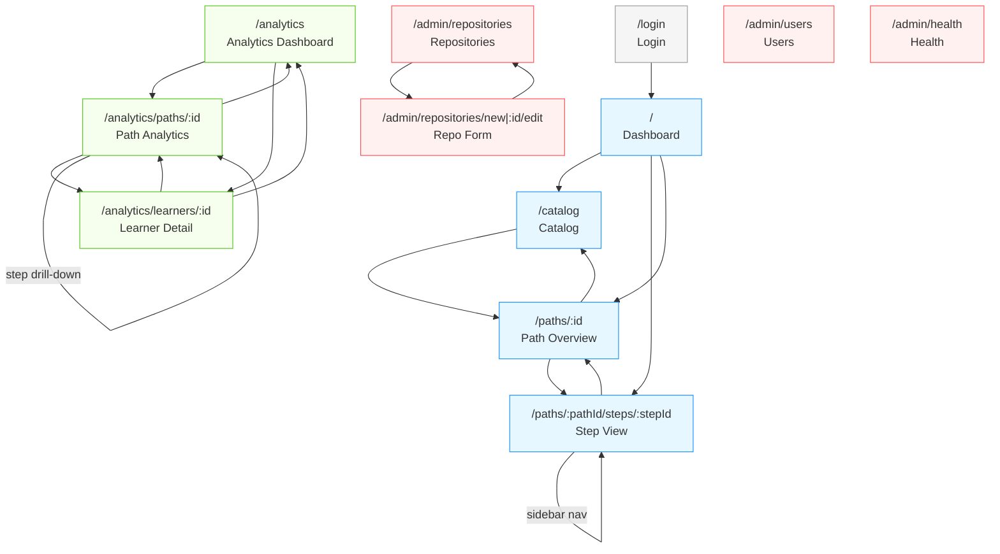

# Phoebus — Detailed Specifications

## 1. Overview

This document provides detailed functional specifications for each feature area of Phoebus. It expands on the use cases and feature breakdown defined in the [Product Specification](./product-specification.md) and references the [Technical Architecture](./technical-architecture.md) for implementation context.

Each section describes the detailed behavior, rules, edge cases, and UI expectations for a feature area.

---

## 2. Content Management

### 2.1 Git Repository Registration

**Description:** Administrators register Git repositories that contain learning path content.

**Detailed Behavior:**

1. Administrator provides:
   - Clone URL (SSH or HTTPS)
   - Authentication type: `none`, `ssh-key`, `http-basic`, `http-token`
   - Credentials (private key, username/password, or token) — stored encrypted
   - Branch to track (default: `main`)

2. Upon registration, Phoebus:
   - Generates a unique webhook UUID
   - Returns the full webhook URL: `https://{phoebus-host}/api/webhooks/{uuid}`
   - Performs an initial clone and sync of the repository
   - Validates the repository structure (presence of `phoebus.yaml`)

3. If the initial clone fails (bad URL, invalid credentials, missing `phoebus.yaml`):
   - The repository is stored with `sync_status: error`
   - An error message is surfaced in the admin UI
   - The repository can be edited and re-synced

**Admin UI — Repository List:**

| Column | Description |
|---|---|
| Name | Learning path title (from `phoebus.yaml`) |
| Clone URL | Git repository URL |
| Branch | Tracked branch |
| Last Synced | Timestamp of last successful sync |
| Status | `synced`, `syncing`, `error`, `never_synced` |
| Actions | Edit, Sync Now, Delete, Copy Webhook URL |

**Edge Cases:**
- Duplicate clone URLs are allowed (different branches)
- Deleting a repository: content is removed from the database, learner progress is preserved (orphaned but not deleted)
- Credentials can be updated without deleting/re-creating the repository

### 2.2 Webhook-Triggered Content Sync

**Description:** Any POST to `/api/webhooks/{uuid}` triggers a content sync for the associated repository.

**Detailed Behavior:**

1. Webhook endpoint receives a POST request
2. Request body is **ignored** (provider-agnostic — works with GitHub, GitLab, Gitea, Bitbucket, or a simple `curl`)
3. The UUID is looked up in `git_repositories`
4. If UUID is unknown: return `404 Not Found`
5. If the repository is already syncing: return `200 OK` (debounce — ignore duplicate triggers)
6. Otherwise: enqueue a sync job and return `200 OK` immediately

**Sync Process (detailed):**

1. Set `sync_status = syncing`
2. Execute `git pull` on the tracked branch (or `git clone` if first sync)
3. Parse directory structure:
   - Read `phoebus.yaml` → update `learning_paths` table
   - For each module directory (ordered by numeric prefix):
     - Read `index.md` → parse front matter → update `modules` table
   - For each step file/directory within each module (ordered by numeric prefix):
     - Single `.md` file → parse front matter + body → update `steps` table
     - Directory with `instructions.md` → parse front matter + body → update `steps` table; read `codebase/` → update `codebase_files` table
4. **Content parsing** (see section 2.3 for per-type details):
   - Extract exercise data from structured Markdown body
   - Store parsed structure in `steps.exercise_data` (JSONB)
   - Store raw Markdown body in `steps.content_md`
5. All database writes are wrapped in a **single transaction** — if any parsing error occurs, the entire sync is rolled back
6. On success: set `sync_status = synced`, update `last_synced_at`
7. On failure: set `sync_status = error`, store error message in `sync_error` column

**Ordering Rules:**
- Module directories are ordered by their numeric prefix: `01-intro/`, `02-basics/`, etc.
- Step files within a module follow the same convention: `01-lesson.md`, `02-quiz.md`, etc.
- If a file/directory has no numeric prefix, it is sorted alphabetically after numbered items
- The numeric prefix is stripped from the display title (the title from front matter is used)

**Content Update Rules:**
- Steps are matched by their file path (relative to repo root) — renaming a file creates a new step
- Updated steps overwrite content and exercise data, but **never delete learner progress**
- Deleted steps (files removed from repo): the `steps` record is soft-deleted (flagged, not removed), preserving associated progress
- New steps are inserted at the position determined by their numeric prefix

**Edge Cases:**
- Webhook storms (multiple pushes in quick succession): debounced by checking `sync_status = syncing`
- Concurrent syncs on different repos: allowed (independent operations)
- Git clone failure (network, auth): `sync_status = error`, admin notified
- Invalid YAML front matter: sync rolls back, error message includes file path and parse error
- Empty module directory (no step files): module is synced with zero steps (allowed)
- Binary files in `codebase/`: silently skipped (only text files are stored)

### 2.3 Content Parsing Rules

The Content Syncer must parse structured Markdown conventions to extract exercise data. This section defines the exact parsing rules for each step type.

#### 2.3.1 Front Matter Parsing

All step files begin with YAML front matter delimited by `---`:

```
---
title: "Step Title"
type: lesson | quiz | terminal-exercise | code-exercise
estimated_duration: "15m"
# Additional fields depending on type
---
```

**Required fields:** `title`, `type`
**Optional fields:** `estimated_duration`, plus type-specific fields (see below)

If `type` is missing or invalid, the step is rejected and the sync fails.

#### 2.3.2 Lesson Parsing

No exercise data to extract. The Markdown body is stored in `content_md` as-is.

`exercise_data`: `null`

#### 2.3.3 Quiz Parsing

**Input:** Markdown body with `## [multiple-choice]` and `## [short-answer]` headings.

**Parsing rules:**

1. Split the body on `## ` headings
2. For each heading:
   - Extract the type tag from brackets: `[multiple-choice]` or `[short-answer]`
   - The rest of the heading is the **question text**
3. For `[multiple-choice]`:
   - Find all lines matching `- [x] ` or `- [ ] `
   - `[x]` = correct answer, `[ ]` = incorrect answer
   - If multiple `[x]`, the question is multi-select; otherwise single-select
   - Lines not matching checkbox syntax are ignored (treated as context text)
4. For `[short-answer]`:
   - Find the first indented code block (4 spaces or 1 tab) — this is the **expected answer pattern** (regex)
   - If no indented code block is found, the step is rejected
5. For both types:
   - Find blockquote lines (`> `) after the choices — this is the **explanation**
   - The explanation is shown to the learner after submission

**Output (`exercise_data` JSONB):**

```json
{
  "questions": [
    {
      "type": "multiple-choice",
      "text": "What is the smallest deployable unit in Kubernetes?",
      "choices": [
        { "text": "Container", "correct": false },
        { "text": "Pod", "correct": true },
        { "text": "Deployment", "correct": false }
      ],
      "multi_select": false,
      "explanation": "A Pod is the smallest deployable unit in Kubernetes."
    },
    {
      "type": "short-answer",
      "text": "Which command lists all running pods?",
      "pattern": "kubectl get pods",
      "explanation": "`kubectl get pods` lists all pods in the current namespace."
    }
  ]
}
```

#### 2.3.4 Terminal Exercise Parsing

**Input:** Markdown body with `## Step N` headings.

**Parsing rules:**

1. Split the body on `## Step ` headings (case-insensitive number matching)
2. Content before the first `## Step` heading is the **exercise introduction** (context text)
3. For each step:
   - Text before the first code block or checkbox is the **context** for that step
   - Find the `` ```console `` code block — this is the **prompt** (decorative, displayed in the terminal UI)
   - Find all lines matching `- [x] ` or `- [ ] ` — these are command proposals:
     - The command is the text inside the **first backtick pair** on the line
     - Text after ` — ` (em dash) is the **explanation**
     - `[x]` = correct command, `[ ]` = incorrect command
   - Find the `` ```output `` code block — this is the **simulated output** displayed after the correct choice
   - Exactly **one** `[x]` command is required per step (error if zero or more than one)

**Output (`exercise_data` JSONB):**

```json
{
  "introduction": "You are logged into a fresh Ubuntu 22.04 server...",
  "steps": [
    {
      "context": "You need to install the container runtime first.",
      "prompt": "$ ▌",
      "proposals": [
        { "command": "apt install docker.io", "correct": false, "explanation": "Docker works but kubeadm recommends containerd..." },
        { "command": "apt install containerd", "correct": true, "explanation": "Containerd is the recommended container runtime..." },
        { "command": "snap install microk8s", "correct": false, "explanation": "MicroK8s is a different Kubernetes distribution..." }
      ],
      "output": "Reading package lists... Done\nSetting up containerd (1.6.20-0ubuntu1) ..."
    }
  ]
}
```

#### 2.3.5 Code Exercise Parsing

**Additional front matter fields:**
- `mode` (required): `identify-and-fix`, `choose-the-fix`, or `identify-then-fix`
- `target` (required for modes A/C): `{ file: "path/to/file.go", lines: [12, 13] }`

**Input:** Markdown body with a `## Patches` section containing `### [x]` or `### [ ]` headings.

**Parsing rules:**

1. Content before `## Patches` is the **problem description** (free Markdown)
2. Split the `## Patches` section on `### ` headings
3. For each patch heading:
   - Extract correctness from brackets: `[x]` = correct, `[ ]` = incorrect
   - The rest of the heading is the **patch label**
   - Text between the heading and the `diff` code block is the **explanation**
   - Find the `` ```diff `` code block — this is the **unified diff** for the patch
   - Exactly **one** `[x]` patch is required per exercise (error if zero or more than one)

**Output (`exercise_data` JSONB):**

```json
{
  "mode": "identify-and-fix",
  "target": { "file": "pkg/handler.go", "lines": [12, 13] },
  "description": "The deployment is failing its liveness probe...",
  "patches": [
    {
      "label": "Fix the status code and response body",
      "correct": true,
      "explanation": "The health endpoint should return 200 OK, not 500.",
      "diff": "--- a/pkg/handler.go\n+++ b/pkg/handler.go\n@@ -11,3 +11,3 @@..."
    },
    {
      "label": "Return 404 Not Found",
      "correct": false,
      "explanation": "404 Not Found is not appropriate for a health check endpoint.",
      "diff": "--- a/pkg/handler.go\n+++ b/pkg/handler.go\n..."
    }
  ]
}
```

**Codebase files:**
- The `codebase/` directory alongside `instructions.md` is read recursively
- Each file's relative path and content are stored in `codebase_files`
- Binary files are silently skipped
- The file tree structure is preserved for Monaco Editor rendering

### 2.4 Markdown Rendering

**Description:** Lesson content and exercise context text is rendered as rich HTML.

**Supported Markdown features:**
- Standard CommonMark (headings, paragraphs, lists, links, images, tables)
- Fenced code blocks with syntax highlighting (language-specific)
- Mermaid diagrams (rendered in the browser)
- Admonition blocks via `remark-directive` plugin: `:::tip`, `:::warning`, `:::danger`, `:::info`, `:::note` (Docusaurus/MkDocs convention). Rendered as styled callout components (a React component maps each directive to a visual block with icon and color)
- Embedded images (relative paths referencing the `assets/` directory)
- HTML inline elements (limited — no scripts)

**Rendering rules:**
- Images with relative paths are resolved against the learning path's asset directory
- Code blocks with a language identifier receive syntax highlighting
- Mermaid code blocks (`` ```mermaid ``) are rendered as SVG diagrams
- Raw HTML is sanitized (script tags, iframes, event handlers are stripped)

> **Not in v1:** LaTeX math rendering (KaTeX/MathJax). DevOps content rarely needs math formulas. Adding KaTeX later is trivial (one remark plugin, no content format change).

---

## 3. Learning Experience

### 3.1 Learning Path Catalog

**Description:** Learners browse and discover available learning paths.

**Behavior:**

1. The catalog page lists all available learning paths
2. Each learning path card displays:
   - Title, description, icon
   - Tags (filterable)
   - Estimated duration
   - Prerequisites (other learning paths)
   - Learner's progress (if enrolled): percentage bar, current step
3. Filtering: by tag, by enrollment status (enrolled, not enrolled, completed)
4. Sorting: alphabetical, by progress, by most recently accessed
5. Search: full-text search on title, description, tags

**Edge Cases:**
- Learning path with unmet prerequisites: displayed with a warning, not blocked (self-assessment philosophy — learner decides)
- Empty learning path (no modules after sync): displayed with a "coming soon" indicator

### 3.2 Learning Path Navigation

**Description:** Learners navigate through the sequential structure of a learning path.

**Behavior:**

1. Sidebar displays the learning path structure:
   - Modules (expandable)
   - Steps within each module (with type icon and completion indicator)
2. Learner clicks on a step to navigate to it
3. Steps are displayed sequentially; navigation is **free** (no enforced order)
   - Rationale: self-assessment philosophy — learners choose their own path
4. Current step is highlighted in the sidebar
5. "Next" and "Previous" buttons navigate to adjacent steps
6. Lesson steps: a "Mark as complete" button is shown at the bottom
7. Exercise steps: completion is automatic upon successful exercise completion

**Completion Logic:**
- A step is completed when:
  - **Lesson**: learner clicks "Mark as complete"
  - **Quiz**: learner submits all answers (regardless of correctness — it's self-assessment)
  - **Terminal Exercise**: learner correctly answers all steps in sequence
  - **Code Exercise**: learner correctly identifies lines (modes A/C) and selects the correct patch
- A module is completed when all its steps are completed
- A learning path is completed when all its modules are completed

### 3.3 Progress Tracking

**Description:** Track and display individual learner progress.

**Behavior:**

1. Each step has a progress status: `not_started`, `in_progress`, `completed`
2. `in_progress` is set when the learner first opens the step
3. `completed` is set according to the completion logic above
4. Progress is stored per learner per step in the `progress` table
5. Module progress = (completed steps / total steps) × 100%
6. Learning path progress = (completed modules / total modules) × 100%

**Personal Dashboard:**
- Lists enrolled learning paths with progress bars
- Shows recently accessed steps (quick resume)
- Shows competencies acquired (linked from modules)
- Shows total steps completed, total time spent (estimated from step durations)

### 3.4 Exercise Reset

**Description:** Learners can reset any exercise to start over.

**Detailed Behavior:**

1. A "Reset" button is available on every exercise step
2. Clicking "Reset" triggers a confirmation dialog
3. Upon confirmation:
   - `progress.status` is set back to `in_progress`
   - `progress.completed_at` is cleared
   - **Previous `exercise_attempts` are preserved** (historical data is never deleted)
   - The exercise UI is reset to its initial state:
     - Quiz: all answers cleared
     - Terminal Exercise: back to Step 1
     - Code Exercise: line selection cleared, patch selection cleared
4. Reset is unlimited (no cap on number of resets)
5. Reset does not affect module or learning path completion status (they are recalculated from step statuses)

---

## 4. Terminal Exercises

### 4.1 Rendering

**Description:** Terminal exercises are displayed in a terminal-like UI component.

**UI Layout:**

```
┌──────────────────────────────────────────────────────┐
│ ● Set Up a Local Cluster                    Step 1/3 │
├──────────────────────────────────────────────────────┤
│                                                      │
│  You are logged into a fresh Ubuntu 22.04 server.    │
│  You need to install the container runtime first.    │
│                                                      │
│  ┌────────────────────────────────────────────────┐  │
│  │ $ ▌                                            │  │
│  └────────────────────────────────────────────────┘  │
│                                                      │
│  Choose the correct command:                         │
│                                                      │
│  ┌────────────────────────────────────────────────┐  │
│  │ ○  apt install docker.io                       │  │
│  │ ○  apt install containerd                      │  │
│  │ ○  snap install microk8s                       │  │
│  └────────────────────────────────────────────────┘  │
│                                                      │
│                          [Submit]                     │
└──────────────────────────────────────────────────────┘
```

**UI Elements:**
- Header: exercise title + step counter (Step N/M)
- Context area: introduction text + per-step context text (Markdown-rendered)
- Prompt area: styled as a terminal (monospace font, dark background). The prompt area renders the instructor-defined `` ```console `` block content as-is. The instructor writes realistic prompts (`root@k8s-master:~# ▌` or `$ ▌`) depending on the scenario context — the prompt is part of the pedagogical exercise
- Command proposals: radio button list (single selection)
- Submit button: validates the selected command

### 4.2 Step-by-Step Flow

**Behavior:**

1. Exercise loads with Step 1 displayed
2. Learner reads the context and selects a command
3. On submit:
   - **Correct**: 
     - The selected command is appended to the prompt area (typed in)
     - The simulated output is displayed below the prompt (terminal-style)
     - A brief success indicator is shown (green check, "Correct!")
     - After a short delay (or user click), the exercise advances to the next step
     - The prompt area accumulates: previous commands and outputs remain visible (scroll up)
   - **Incorrect**:
     - The explanation for the incorrect choice is displayed (inline, below the proposals)
     - The incorrect choice is visually marked (red, strike-through) and disabled
     - The learner selects another command and re-submits
     - Number of retries is unlimited
4. When the last step is answered correctly:
   - The exercise is marked as completed
   - A summary is shown (all steps with the correct commands and outputs)

**Attempt Recording:**

Each attempt (correct or incorrect) is recorded as an `exercise_attempt`:

```json
{
  "step_number": 1,
  "selected_command": "apt install docker.io",
  "is_correct": false
}
```

A new attempt record is created for every submission. The `answers` JSONB stores which command was selected and which step it applies to. This allows instructors to analyze:
- Which incorrect commands are most commonly selected
- How many attempts each step takes on average
- Which steps are the most difficult

### 4.3 Edge Cases

- Exercise with a single step: behaves the same (just no step progression)
- All choices eliminated (all incorrect selected): theoretically impossible since the correct one is always available
- Content update during an exercise: the learner continues with the version they started; on next load, the updated version is shown
- Browser refresh mid-exercise: on load, the frontend fetches existing `exercise_attempts` and resumes after the last correctly-answered step. No new DB field needed — reuses data already recorded by server-side validation. Progress survives page refresh. If the exercise was already completed, the `progress` record is already `completed`.

---

## 5. Code Exercises

### 5.1 Rendering

**Description:** Code exercises display a read-only code viewer with a problem description and patch proposals.

**UI Layout (Mode A — Identify & Fix):**

```
┌──────────────────────────────────────────────────────────────────┐
│ ● Fix the Health Check Handler                      Phase 1/2   │
├──────────────────────┬───────────────────────────────────────────┤
│ File Tree            │ Editor (read-only)                        │
│                      │                                           │
│ ▾ codebase/          │  1  package handler                       │
│   ├── main.go        │  2                                        │
│   ├── go.mod         │  3  import (                               │
│   └── pkg/           │  4      "net/http"                         │
│       └── handler.go │  5  )                                      │
│            ★         │  6                                        │
│                      │  7  // HandleHealth responds to            │
│                      │  8  // health check requests               │
│                      │  9  func HandleHealth(w http.ResponseWr    │
│                      │ 10      r *http.Request) {                 │
│                      │ 11                                        │
│                      │ 12▸     w.WriteHeader(http.StatusInternalE │
│                      │ 13▸     w.Write([]byte("error"))           │
│                      │ 14  }                                      │
│                      │                                           │
├──────────────────────┴───────────────────────────────────────────┤
│                                                                  │
│  The deployment is failing its liveness probe. The               │
│  HandleHealth function is returning the wrong status code.       │
│                                                                  │
│  Click on the lines you think are problematic.                   │
│                                                                  │
│  Selected lines: 12, 13                    [Validate Selection]  │
│                                                                  │
└──────────────────────────────────────────────────────────────────┘
```

**UI Elements:**
- **File tree** (left panel): navigable file tree from the `codebase/` directory. The target file is highlighted (★)
- **Code viewer** (right panel): Monaco Editor in read-only mode. Line numbers, syntax highlighting. Clickable lines (for modes A/C)
- **Problem description**: Markdown-rendered text below the code viewer
- **Phase indicator**: shows current phase (Phase 1: Identify, Phase 2: Fix) for modes A/C
- **Selected lines display**: shows the lines the learner has clicked on
- **Patch proposals** (Phase 2): displayed as inline unified diffs (Monaco inline diff view). The familiar `git diff` / PR format fits the constrained layout and matches the authoring format. Side-by-side diff can be added later if needed

### 5.2 Mode A — Identify & Fix

**Flow:**

1. **Phase 1 — Identify:**
   - Code viewer is displayed with all files from `codebase/`
   - The target file is pre-selected in the file tree (but the learner can browse other files)
   - Learner clicks on lines they believe are problematic
   - Clicking a line toggles its selection (click again to deselect)
   - A "Validate Selection" button submits the selected lines
   - **Validation**: the selected lines are compared against `target.lines` from `exercise_data`
     - **Exact match required**: learner must select exactly the target lines (no more, no fewer)
     - Feedback is **progressive**: partial matches receive guiding hints (e.g., "1/2 lines found", "right area, refine your selection") rather than a binary correct/incorrect
     - **Correct**: visual confirmation (green highlight on target lines), advance to Phase 2
     - **Incorrect**: progressive feedback helps the learner converge on the right lines, allow retry
   
2. **Phase 2 — Fix:**
   - The target lines remain highlighted during Phase 2 as a visual reminder, helping the learner verify that the selected patch applies to the correct location
   - Patch proposals are displayed below the code viewer
   - Each patch shows: label, diff block (syntax-highlighted unified diff)
   - Learner selects one patch via radio buttons
   - On submit:
     - **Correct**: explanation is shown (green), exercise is marked as completed
     - **Incorrect**: explanation for the selected patch is shown (red), learner can retry

### 5.3 Mode B — Choose the Fix

**Flow:**

1. Single phase — no line identification
2. Code viewer is displayed (same as Mode A)
3. Patch proposals are displayed immediately below the code viewer
4. Learner reviews each diff and selects the correct one
5. On submit:
   - **Correct**: explanation shown, exercise completed
   - **Incorrect**: explanation for selected patch shown, allow retry

**Note:** In Mode B, `target` is not required in front matter (no line identification step).

### 5.4 Mode C — Identify, then Fix

Identical to Mode A in behavior, but the two phases are more explicitly separated in the UI:
- Phase 1 only shows the code viewer and line selection (no patches visible)
- Phase 2 only shows the patches (the code viewer is still visible for reference but line selection is locked)

The distinction is primarily in the UI presentation, not in the underlying logic.

### 5.5 Attempt Recording

Each attempt records the learner's action:

**Phase 1 (line identification) attempt:**
```json
{
  "phase": "identify",
  "selected_lines": [10, 11, 12],
  "is_correct": false
}
```

**Phase 2 (patch selection) attempt:**
```json
{
  "phase": "fix",
  "selected_patch": "Return 404 Not Found",
  "is_correct": false
}
```

### 5.6 Edge Cases

- Large codebase (many files): file tree is scrollable; no limit on number of files
- Target lines span multiple files: **not supported in v1** — target must reference a single file
- Empty `codebase/` directory: exercise is rejected during content sync
- Binary files in `codebase/`: skipped (not shown in the file tree)
- Diff references lines that don't exist: the diff is displayed as-is (the content syncer does not validate diff applicability)

---

## 6. Quizzes

### 6.1 Rendering

**Description:** Quizzes display questions one at a time with immediate feedback. A "Question N/M" counter is shown in the header to indicate progress (as shown in the UI layout below).

**UI Layout:**

```
┌──────────────────────────────────────────────────────┐
│ ● Kubernetes Basics                        Q 1/3     │
├──────────────────────────────────────────────────────┤
│                                                      │
│  What is the smallest deployable unit in Kubernetes? │
│                                                      │
│  ☐  Container                                        │
│  ☐  Pod                                              │
│  ☐  Deployment                                       │
│                                                      │
│                          [Submit]                     │
└──────────────────────────────────────────────────────┘
```

### 6.2 Question Rendering

**Multiple-choice (single-select):**
- Questions with exactly one `[x]` answer are rendered as radio buttons
- Learner selects one answer and clicks "Submit"

**Multiple-choice (multi-select):**
- Questions with more than one `[x]` answer are rendered as checkboxes
- A hint is shown: "Select all that apply"
- Learner selects one or more answers and clicks "Submit"

**Short-answer:**
- Rendered as a text input field
- On submit, the learner's answer is validated against the expected pattern (regex match)
- Matching is case-insensitive by default
- Multiple valid answers are supported natively via regex alternatives (e.g., `kubectl get po(ds)?`, `^(kubectl|k) get pods$`). Instructors should document their regex patterns clearly

### 6.3 Submission & Feedback

**Behavior:**

1. Learner answers a question and clicks "Submit"
2. Feedback is shown immediately:
   - **Multiple-choice**: correct answers are highlighted in green, incorrect selections in red
   - **Short-answer**: "Correct" or "Incorrect" with the expected answer shown
3. The explanation blockquote is displayed below the feedback
4. Learner clicks "Next Question" to proceed (the learner cannot go back to a previous question — immediate feedback reveals the correct answer, making re-answering meaningless. Linear progression, consistent with terminal and code exercises)
5. After the last question, a summary is shown:
   - Number of correct answers out of total
   - List of questions with correct/incorrect status
   - Option to review explanations

**Completion logic:**
- A quiz is marked as completed once all questions have been submitted (regardless of correctness)
- Rationale: self-assessment — the learner sees their results and decides if they need to review

### 6.4 Attempt Recording

Each question submission is recorded:

```json
{
  "question_index": 0,
  "type": "multiple-choice",
  "selected": ["Pod"],
  "is_correct": true
}
```

For short-answer:
```json
{
  "question_index": 1,
  "type": "short-answer",
  "answer": "kubectl get pods",
  "is_correct": true
}
```

### 6.5 Edge Cases

- Quiz with a single question: no "Next Question" button, summary is shown immediately
- Short-answer with regex pattern: the syncer validates the regex during content parsing (reject invalid regex)
- Empty quiz (no questions parsed): rejected during content sync
- Multiple-choice with all answers correct: allowed (trivial question, but valid)

---

## 7. Analytics & Progress Tracking

### 7.1 Learner Dashboard

**Description:** Each learner has a personal dashboard showing their progress.

**Content:**

| Section | Data |
|---|---|
| Enrolled Paths | List of learning paths with progress bars (% completed) |
| Current Step | The last step the learner was working on (quick resume link) |
| Competencies | Acquired competencies from completed modules |
| Activity | Recent activity: steps completed, exercises attempted |
| Statistics | Total steps completed, total exercises attempted, total time (estimated) |

### 7.2 Instructor Analytics

**Description:** Instructors see aggregated analytics for all learning paths.

**Visibility:** All instructors can see analytics for all learning paths (no scoping). In a single-tenant deployment (same company), compartmentalization between instructors adds no value. If scoping is needed later, OIDC groups can be leveraged.

**Content:**

| Section | Data |
|---|---|
| Enrollment | Number of learners enrolled per learning path |
| Progress Distribution | Histogram of learner progress (how many at 0-25%, 25-50%, etc.) |
| Completion Rate | Percentage of enrolled learners who completed the full path |
| Step-Level Stats | Per step: completion rate, average attempts (for exercises), most common wrong answers |
| Failure Points | Steps with the lowest completion rate (potential content improvement targets) |
| Common Wrong Answers | For terminal/code/quiz exercises: which incorrect choices are selected most often |

**Computation:** Analytics are computed in real-time via SQL queries on demand. No batch jobs, no cache tables, no stale data. At target scale (200 users, ~30K rows), PostgreSQL aggregates in <10ms. Materialized views can be added later without architecture changes if scale grows.

**Drill-down:**
- Click on a step to see detailed attempt distribution
- Click on a learner to see their individual progress timeline

### 7.3 Manager View (Optional, Could Have)

Managers can view aggregated progress for their team members. Teams are derived from OIDC group claims (mapped via a configurable `group_claim` setting). No manual team management in Phoebus — the enterprise directory (AD/LDAP → OIDC) is the source of truth. Groups are refreshed on each login.

---

## 8. Administration

### 8.1 User Management

**Description:** Administrators manage users and roles.

**Behavior:**

1. Users are created automatically upon first SSO login (OIDC/LDAP)
2. When local auth is enabled, users can self-register via a signup form on the login page (created with role `learner`)
3. Administrators can create local users manually from the Admin > Users view (with a chosen role and temporary password)
4. Default role for new users: `learner`
5. Administrators can change a user's role: `learner`, `instructor`, `admin`
6. Administrators can deactivate users (soft-delete — they cannot log in but their data is preserved)
7. User list displays: name, email, role, last login, number of completed paths

**RBAC Matrix:**

| Action | Learner | Instructor | Admin |
|---|---|---|---|
| Browse catalog | ✅ | ✅ | ✅ |
| Enroll in learning path | ✅ | ✅ | ✅ |
| Complete exercises | ✅ | ✅ | ✅ |
| View own progress | ✅ | ✅ | ✅ |
| View analytics (all learners) | ❌ | ✅ | ✅ |
| Register Git repository | ❌ | ❌ | ✅ |
| Trigger manual sync | ❌ | ❌ | ✅ |
| Manage users | ❌ | ❌ | ✅ |
| View platform health | ❌ | ❌ | ✅ |

### 8.2 Repository Management

See section 2.1 (Git Repository Registration). The admin UI provides:
- List of registered repositories with sync status
- Ability to add, edit, delete repositories
- Manual sync trigger
- Webhook URL display and copy

### 8.3 Platform Health

**Description:** Administrators monitor platform health.

**Metrics:**
- Application uptime
- Database connection status
- Git sync status per repository (last sync time, errors)
- Active user count (users logged in within the last 24h)
- API response times (p50, p95, p99)
- Disk usage (cloned Git repos)

**Delivery:** Prometheus metrics endpoint (`/metrics`) + optional health dashboard in the admin UI.

---

## 9. Authentication & Authorization

### 9.1 OIDC Authentication

**Flow:**

1. User accesses Phoebus → redirected to OIDC provider login page
2. User authenticates with their corporate credentials
3. OIDC provider redirects back to Phoebus with an authorization code
4. Phoebus exchanges the code for an ID token and access token
5. Phoebus creates or updates the user record (matched by `external_id` or email)
6. A session token (JWT) is issued as an httpOnly cookie (see section 9.3)
7. Subsequent API requests carry the JWT automatically via the cookie — no `Authorization` header needed

**Configuration:**
- OIDC issuer URL
- Client ID and client secret
- Scopes (default: `openid email profile`)
- Claim mapping: which OIDC claim maps to display name, email, external ID

### 9.2 LDAP Authentication

**Flow:**

1. User submits username/password on the Phoebus login page
2. Phoebus performs an LDAP bind with the provided credentials
3. If bind succeeds, Phoebus fetches user attributes (name, email, groups). LDAP group membership is synced on every login (no caching). Login happens once per session (~8h), so one extra LDAP query is negligible. Consistent with OIDC behavior (claims refreshed on auth)
4. User record is created or updated
5. A session token (JWT) is issued

**Configuration:**
- LDAP server URL
- Base DN for user search
- User search filter (e.g., `(uid={username})`)
- Attribute mapping: which LDAP attributes map to display name, email
- Optional: group-to-role mapping (e.g., LDAP group "trainers" → role `instructor`)

### 9.3 Session Management

- JWT tokens with configurable expiration (default: 8 hours)
- Refresh token support for seamless re-authentication
- JWT is stored in an httpOnly cookie with `SameSite=Lax`. Immune to XSS (critical for a SPA rendering user-provided Markdown as HTML). The frontend never touches the token — it is sent automatically by the browser
- CSRF protection via `SameSite=Lax` + JSON-only API (no cross-origin form submission). OWASP recommended
- Logout invalidates the JWT (client-side cookie deletion; server-side blacklist is optional)

### 9.4 Local Authentication (Fallback)

**Description:** A minimal local authentication mechanism for bootstrap and development scenarios.

**Flow:**

1. User submits username/password on the Phoebus login page (same form as LDAP)
2. Phoebus verifies the password against a bcrypt hash stored in the `users` table
3. If valid, a session token (JWT) is issued as an httpOnly cookie (same as OIDC/LDAP)

**Self-Registration (Signup):**

When local auth is enabled, a "Create account" link is displayed below the login form. Clicking it reveals a registration form:

1. User fills in: username, display name, email (optional), password, confirm password
2. `POST /api/auth/register` creates the user with role `learner` and `auth_provider: local`
3. On success, the user is automatically logged in (JWT cookie set) and redirected to `/`

**Constraints:**
- Signup is only available when local auth is enabled (`local_auth.enabled: true`)
- Username must be unique (4–32 chars, alphanumeric + hyphens)
- Password minimum length: 8 characters
- If username already exists → error "Username already taken"

**Admin User Creation:**

Administrators can create local users from the Admin > Users view:

1. Admin clicks "Add User" button
2. Modal form: username, display name, email, role (learner/instructor/admin), password
3. `POST /api/admin/users` creates the user with `auth_provider: local`
4. The created user can log in immediately with the provided credentials

**Scope:**
- Bcrypt-hashed passwords
- `/api/auth/login` endpoint
- `/api/auth/register` endpoint (self-registration)
- `/api/admin/users` endpoint (admin creation with `POST`)
- No password reset functionality
- No password complexity policy (beyond minimum 8 chars)
- Essential for bootstrap (first admin account), getting started (`docker compose up` → immediate login), and development

**Configuration:**
- Enabled/disabled via `local_auth.enabled` (default: `true`)
- Disabled in production via `local_auth.enabled: false`
- When disabled, `/api/auth/register` returns `403 Forbidden` and signup UI is hidden

---

## 10. SPA Views

This section inventories every view (page) of the Phoebus single-page application. For each view it defines the route, required role, layout, data loaded, API calls, navigation targets, and detailed interactions.

### 10.1 Global Layout

All authenticated views share a common shell layout:

```
┌─────────────────────────────────────────────────────────────────────┐
│  🔥 Phoebus           Catalog   Dashboard        [User ▾] [Logout] │
├─────────────────────────────────────────────────────────────────────┤
│                                                                     │
│                        <Page Content>                               │
│                                                                     │
└─────────────────────────────────────────────────────────────────────┘
```

**Header (global, always visible):**

| Element | Behavior |
|---|---|
| Logo + name | Click → navigates to Dashboard (`/`) |
| Catalog link | Navigates to `/catalog` |
| Dashboard link | Navigates to `/` |
| Analytics link | Visible only for `instructor` and `admin` roles. Navigates to `/analytics` |
| Admin link | Visible only for `admin` role. Opens a dropdown: Repositories, Users, Health |
| User menu | Dropdown: display name, role badge, Logout |

**Unauthenticated views** (Login) render without the header — they use a centered, minimal layout.

**Learning Path views** (`/paths/:pathId/steps/:stepId`) replace the global header with a learning-specific header that includes a sidebar (see section 10.7).

### 10.2 Route Table

| Route | View | Min. Role | Layout | Section |
|---|---|---|---|---|
| `/login` | Login | — (public) | Centered | 10.3 |
| `/` | Dashboard | `learner` | Global shell | 10.4 |
| `/catalog` | Catalog | `learner` | Global shell | 10.5 |
| `/paths/:pathId` | Learning Path Overview | `learner` | Global shell | 10.6 |
| `/paths/:pathId/steps/:stepId` | Step View | `learner` | Learning layout | 10.7 |
| `/analytics` | Analytics Dashboard | `instructor` | Global shell | 10.8 |
| `/analytics/paths/:pathId` | Learning Path Analytics | `instructor` | Global shell | 10.9 |
| `/analytics/learners/:learnerId` | Learner Detail | `instructor` | Global shell | 10.10 |
| `/admin/repositories` | Repository Management | `admin` | Global shell | 10.11 |
| `/admin/repositories/new` | Add Repository | `admin` | Global shell | 10.12 |
| `/admin/repositories/:repoId/edit` | Edit Repository | `admin` | Global shell | 10.12 |
| `/admin/users` | User Management | `admin` | Global shell | 10.13 |
| `/admin/health` | Platform Health | `admin` | Global shell | 10.14 |

**Access control:** The frontend checks the user's role (from the JWT payload decoded client-side — the httpOnly cookie contains the JWT but a non-sensitive role claim is also available via a `/api/me` call on page load) and hides inaccessible navigation links. The backend enforces RBAC on every API call — a direct URL access to an unauthorized route returns `403 Forbidden`.

**Redirect rules:**
- Unauthenticated user accessing any route → redirect to `/login?redirect={originalUrl}`
- Authenticated user accessing `/login` → redirect to `/`
- User accessing a route above their role → redirect to `/` with a toast notification ("Access denied")

### 10.3 Login (`/login`)

**Purpose:** Authenticate the user via OIDC, LDAP, or local credentials. Optionally allow self-registration.

**Layout:** Centered card on a neutral background, no global header.

```
┌─────────────────────────────────────┐
│           🔥 Phoebus                │
│                                     │
│  ┌─────────────────────────────┐    │
│  │  Sign in with SSO           │    │  ← OIDC button (if configured)
│  └─────────────────────────────┘    │
│                                     │
│  ──────── or sign in below ──────── │  ← Divider (if LDAP or local auth)
│                                     │
│  Username  [___________________]    │
│  Password  [___________________]    │
│                                     │
│        [Sign In]                    │
│                                     │
│  Don't have an account? Create one  │  ← Link (if local auth enabled)
│                                     │
│  ⚠ Invalid credentials             │  ← Error (conditional)
└─────────────────────────────────────┘
```

**Registration form** (toggled via "Create one" link, replaces login form):

```
┌─────────────────────────────────────┐
│           🔥 Phoebus                │
│                                     │
│  Create your account                │
│                                     │
│  Username      [___________________]│
│  Display Name  [___________________]│
│  Email         [___________________]│  ← Optional
│  Password      [___________________]│
│  Confirm       [___________________]│
│                                     │
│        [Create Account]             │
│                                     │
│  Already have an account? Sign in   │  ← Link back to login form
│                                     │
│  ⚠ Username already taken           │  ← Error (conditional)
└─────────────────────────────────────┘
```

**Elements:**

| Element | Condition | Behavior |
|---|---|---|
| SSO button | OIDC is configured | Redirects to OIDC provider (external redirect via `GET /api/auth/oidc/redirect`) |
| Username/password form | LDAP or local auth enabled | `POST /api/auth/login` with credentials |
| "Create account" link | Local auth enabled | Toggles to registration form |
| Registration form | Local auth enabled + user clicked link | `POST /api/auth/register` with `{ username, display_name, email, password }` |
| Error message | On failed login or registration | "Invalid credentials" or "Username already taken" (no distinction between wrong user/wrong password for security) |

**API Calls:**
- `POST /api/auth/login` — LDAP/local authentication (sets httpOnly cookie on success)
- `POST /api/auth/register` — Local self-registration (creates user with role `learner`, sets httpOnly cookie on success)
- `GET /api/auth/oidc/redirect` — returns OIDC provider URL for browser redirect

**Navigation:**
- On successful login → redirect to `/` (or to the URL stored in `?redirect=` query param)

**Conditional behavior:**
- If OIDC is the only configured provider (LDAP + local auth disabled) → auto-redirect to OIDC provider (skip login page entirely)
- If only local auth is enabled → show only username/password form (no SSO button, no divider)

### 10.4 Dashboard (`/`)

**Purpose:** Personal landing page showing the learner's progress and activity.

**Required role:** `learner` (all authenticated users)

**Layout:** Global shell. Single-column responsive content.

```
┌──────────────────────────────────────────────────────────────────────┐
│ Header                                                               │
├──────────────────────────────────────────────────────────────────────┤
│                                                                      │
│  Welcome back, François                                              │
│                                                                      │
│  ┌─ Continue Learning ────────────────────────────────────────────┐  │
│  │ ● Kubernetes Fundamentals — Step: ConfigMap & Secrets   [→]   │  │
│  └────────────────────────────────────────────────────────────────┘  │
│                                                                      │
│  ┌─ My Learning Paths ───────────────────────────────────────────┐  │
│  │                                                                │  │
│  │  Kubernetes Fundamentals          ████████████░░ 72%    [→]   │  │
│  │  GitOps with ArgoCD               ███░░░░░░░░░░░ 20%    [→]   │  │
│  │  Terraform Advanced               ░░░░░░░░░░░░░░  0%    [→]   │  │
│  │                                                                │  │
│  └────────────────────────────────────────────────────────────────┘  │
│                                                                      │
│  ┌─ Competencies ─────────┐  ┌─ Statistics ──────────────────────┐  │
│  │ ✅ Container Basics    │  │  Steps completed:    42            │  │
│  │ ✅ kubectl CLI         │  │  Exercises attempted: 28            │  │
│  │ ⬜ Helm Charts         │  │  Est. time spent:    12h30         │  │
│  └────────────────────────┘  └────────────────────────────────────┘  │
│                                                                      │
│  ┌─ Recent Activity ─────────────────────────────────────────────┐  │
│  │ Today     Completed "Pod Lifecycle" quiz (3/3 correct)        │  │
│  │ Yesterday Completed terminal exercise "Deploy with kubectl"   │  │
│  │ 2 days    Started module "Services & Networking"              │  │
│  └────────────────────────────────────────────────────────────────┘  │
│                                                                      │
└──────────────────────────────────────────────────────────────────────┘
```

**Sections:**

| Section | Data Source | Behavior |
|---|---|---|
| Continue Learning | Last accessed step (`progress` table, most recent `updated_at` where status = `in_progress`) | Click → `/paths/:pathId/steps/:stepId`. Hidden if no in-progress step |
| My Learning Paths | `progress` aggregated by learning path | Progress bars. Click → `/paths/:pathId`. Shows only enrolled paths (at least one step accessed) |
| Competencies | `modules.competencies` for completed modules | ✅ for acquired, ⬜ for pending |
| Statistics | Aggregated from `progress` + `exercise_attempts` | Total steps completed, total exercises attempted, estimated time (sum of `estimated_duration` for completed steps) |
| Recent Activity | `progress` + `exercise_attempts` ordered by timestamp | Last 10 activities. Each links to the relevant step |

**API Calls:**
- `GET /api/me/dashboard` — returns all dashboard data in a single call (enrolled paths with progress, last step, competencies, stats, recent activity)

**Navigation targets:**
- Continue Learning card → `/paths/:pathId/steps/:stepId`
- Learning path row → `/paths/:pathId`
- Activity item → `/paths/:pathId/steps/:stepId`
- If no enrolled paths → show a call-to-action: "Start learning → Browse catalog" → `/catalog`

### 10.5 Catalog (`/catalog`)

**Purpose:** Browse and discover all available learning paths.

**Required role:** `learner` (all authenticated users)

**Layout:** Global shell. Grid of learning path cards with filter/search controls.

```
┌──────────────────────────────────────────────────────────────────────┐
│ Header                                                               │
├──────────────────────────────────────────────────────────────────────┤
│                                                                      │
│  Learning Path Catalog                                               │
│                                                                      │
│  [🔍 Search learning paths...                               ]       │
│                                                                      │
│  Filters:  [All ▾]  [Tag: kubernetes ✕]  [Sort: A-Z ▾]             │
│                                                                      │
│  ┌──────────────────┐  ┌──────────────────┐  ┌──────────────────┐   │
│  │ 🎯 Kubernetes    │  │ 🔄 GitOps with   │  │ 🏗 Terraform     │   │
│  │ Fundamentals     │  │ ArgoCD           │  │ Advanced         │   │
│  │                  │  │                  │  │                  │   │
│  │ 5 modules · 3h   │  │ 3 modules · 2h   │  │ 4 modules · 4h   │   │
│  │ #kubernetes      │  │ #gitops #argocd  │  │ #terraform #iac  │   │
│  │ #containers      │  │                  │  │                  │   │
│  │                  │  │                  │  │                  │   │
│  │ ████████░░ 72%   │  │ ███░░░░░░░ 20%   │  │ Not started      │   │
│  └──────────────────┘  └──────────────────┘  └──────────────────┘   │
│                                                                      │
└──────────────────────────────────────────────────────────────────────┘
```

**Card content:**

| Element | Source |
|---|---|
| Icon | `phoebus.yaml` → `icon` |
| Title | `phoebus.yaml` → `title` |
| Description | `phoebus.yaml` → `description` (truncated to ~100 chars) |
| Module count + duration | Computed from modules and `estimated_duration` |
| Tags | `phoebus.yaml` → `tags` (clickable — toggles filter) |
| Prerequisites | Shown as warning badge if unmet |
| Progress | From `progress` table. "Not started" if no progress |

**Filters & Search:**

| Control | Behavior |
|---|---|
| Search input | Client-side full-text filter on title, description, tags. Debounced (300ms) |
| Tag filter | Click a tag on a card or in the filter bar to toggle. Multiple tags = AND. Shown as removable chips |
| Status filter | Dropdown: All, Not Started, In Progress, Completed |
| Sort | Dropdown: Alphabetical (A-Z), Most Recent, Progress (desc) |

**API Calls:**
- `GET /api/learning-paths` — returns all learning paths with metadata
- `GET /api/me/progress` — returns the learner's progress for all paths (to overlay on cards)

**Navigation targets:**
- Click a card → `/paths/:pathId`

### 10.6 Learning Path Overview (`/paths/:pathId`)

**Purpose:** Display learning path details, module structure, and allow the learner to start or continue.

**Required role:** `learner` (all authenticated users)

**Layout:** Global shell. Single-column content.

```
┌──────────────────────────────────────────────────────────────────────┐
│ Header                                                               │
├──────────────────────────────────────────────────────────────────────┤
│                                                                      │
│  ← Back to Catalog                                                   │
│                                                                      │
│  🎯 Kubernetes Fundamentals                                          │
│                                                                      │
│  Master the fundamentals of Kubernetes: from pods to deployments,    │
│  services, and configuration management.                             │
│                                                                      │
│  Tags: #kubernetes #containers #orchestration                        │
│  Duration: ~3 hours · 5 modules · 18 steps                          │
│  Prerequisites: Docker Basics (✅ completed)                         │
│                                                                      │
│  Progress: ████████████░░░░ 72%               [Continue Learning]    │
│                                                                      │
│  ┌─ Modules ─────────────────────────────────────────────────────┐   │
│  │                                                                │   │
│  │  ✅ 1. Introduction to Kubernetes         4 steps   ✓ done    │   │
│  │     ├── ✅ 📖 What is Kubernetes?                             │   │
│  │     ├── ✅ 📖 Architecture Overview                           │   │
│  │     ├── ✅ ❓ Key Concepts Quiz                               │   │
│  │     └── ✅ 💻 Install minikube                                │   │
│  │                                                                │   │
│  │  🔵 2. Pods & Containers                  5 steps   3/5       │   │
│  │     ├── ✅ 📖 Pod Basics                                      │   │
│  │     ├── ✅ 💻 Create a Pod                                    │   │
│  │     ├── ✅ ❓ Pod Lifecycle                                    │   │
│  │     ├── ○  🔧 Fix Pod CrashLoop           ← current          │   │
│  │     └── ○  📖 Multi-container Pods                            │   │
│  │                                                                │   │
│  │  ▸ 3. Services & Networking               4 steps   0/4       │   │
│  │  ▸ 4. Configuration                       3 steps   0/3       │   │
│  │  ▸ 5. Deployments & Rollouts              2 steps   0/2       │   │
│  │                                                                │   │
│  └────────────────────────────────────────────────────────────────┘   │
│                                                                      │
└──────────────────────────────────────────────────────────────────────┘
```

**Elements:**

| Element | Behavior |
|---|---|
| ← Back to Catalog | Navigates to `/catalog` |
| Path metadata | Title, description, tags, duration, prerequisites, module/step count |
| Prerequisite status | ✅ if completed, ⚠ if not (with link to the prerequisite path). Not blocking — advisory only |
| Progress bar + percentage | Overall learning path completion |
| Continue Learning button | Navigates to the next incomplete step. Becomes "Start Learning" if not started. Hidden if completed |
| Module list | Expandable/collapsible (Ant Design Collapse). Shows step list with type icons and completion |
| Current step indicator | "← current" on the last in-progress step |

**Step type icons:** 📖 Lesson · ❓ Quiz · 💻 Terminal Exercise · 🔧 Code Exercise

**API Calls:**
- `GET /api/learning-paths/:pathId` — returns path metadata, modules, steps (titles, types, order)
- `GET /api/me/progress?path_id=:pathId` — returns learner's progress for all steps in this path

**Navigation targets:**
- Click any step → `/paths/:pathId/steps/:stepId`
- Continue Learning → `/paths/:pathId/steps/:stepId` (next incomplete step)
- Prerequisite link → `/paths/:prerequisitePathId`
- ← Back to Catalog → `/catalog`

### 10.7 Step View (`/paths/:pathId/steps/:stepId`)

**Purpose:** Display and interact with a single learning step (lesson, quiz, terminal exercise, or code exercise).

**Required role:** `learner` (all authenticated users)

**Layout:** Replaces the global shell with a learning-specific layout: collapsible sidebar + full-width content area.

```
┌──────────────────────────────────────────────────────────────────────┐
│  ← Kubernetes Fundamentals                              [☰] [✕]    │
├──────────────┬───────────────────────────────────────────────────────┤
│ Sidebar      │  Content Area                                        │
│              │                                                       │
│ ▾ Module 1   │  (varies by step type — see 10.7.1 to 10.7.4)       │
│   ✅ Step 1  │                                                       │
│   ✅ Step 2  │                                                       │
│   ✅ Step 3  │                                                       │
│ ▾ Module 2   │                                                       │
│   ✅ Step 1  │                                                       │
│   🔵 Step 2  │                                                       │
│   ○  Step 3  │                                                       │
│ ▸ Module 3   │                                                       │
│ ▸ Module 4   │                                                       │
│              │                                                       │
│              ├───────────────────────────────────────────────────────┤
│              │  [← Previous]                          [Next →]      │
└──────────────┴───────────────────────────────────────────────────────┘
```

**Header elements:**

| Element | Behavior |
|---|---|
| ← Path title | Click → back to `/paths/:pathId` (learning path overview) |
| ☰ (hamburger) | Toggle sidebar visibility. Default: expanded on desktop (≥1024px), collapsed on mobile |
| ✕ (close) | Exit learning mode → `/paths/:pathId` |

**Sidebar:**

| Element | Behavior |
|---|---|
| Module headers | Expandable/collapsible (Ant Design Menu in inline mode). Title + completion count (e.g., "3/5") |
| Step entries | Type icon + title + completion indicator (✅ completed, 🔵 in-progress, ○ not started). Click → navigate to that step |
| Current step | Active state (bold, accent background color) |
| Scroll | Auto-scrolls to keep the current step visible on load |

**Footer navigation:**

| Element | Behavior |
|---|---|
| ← Previous | Navigate to the previous step (across module boundaries). Hidden on first step |
| Next → | Navigate to the next step. Hidden on last step. Label changes to "Complete Path" on the last step of the last module if all steps are completed |

**Content area — varies by step type:**

#### 10.7.1 Lesson Step

Renders the Markdown body as rich HTML (see section 2.4 for rendering rules).

| Element | Behavior |
|---|---|
| Rendered content | Full Markdown rendering: headings, code blocks, Mermaid diagrams, admonitions, images |
| "Mark as Complete" button | Bottom of content. `POST /api/progress/:stepId/complete`. Becomes "✅ Completed" (disabled) after click |

**API Calls:**
- `GET /api/learning-paths/:pathId/steps/:stepId` — returns `content_md` + step metadata
- `POST /api/progress/:stepId/complete` — marks step as completed

#### 10.7.2 Quiz Step

Renders questions one at a time with immediate feedback (see section 6 for detailed behavior).

| Element | Behavior |
|---|---|
| Question counter | "Question N/M" in the content header |
| Question text | Markdown-rendered |
| Answer input | Radio buttons (single-select), checkboxes (multi-select), or text input (short-answer) |
| Submit button | `POST /api/exercises/:stepId/attempt` with answer payload. Server returns `{ is_correct, explanation, correct_answer }` |
| Feedback | Green/red highlight + explanation blockquote. Shown immediately after submit |
| Next Question | Advances to next question. No going back (see section 6.3) |
| Summary panel | After last question: correct count, per-question status, "Review Explanations" toggle |
| Reset button | Top-right corner. Confirmation dialog → `POST /api/exercises/:stepId/reset` |

**API Calls:**
- `GET /api/learning-paths/:pathId/steps/:stepId` — step metadata + sanitized `exercise_data` (questions without `correct` flags)
- `POST /api/exercises/:stepId/attempt` — submit one question answer
- `GET /api/exercises/:stepId/attempts` — resume from last answered question
- `POST /api/exercises/:stepId/reset` — reset quiz

#### 10.7.3 Terminal Exercise Step

Renders the terminal simulator (see section 4 for detailed behavior).

| Element | Behavior |
|---|---|
| Step counter | "Step N/M" in the content header |
| Introduction | Markdown-rendered exercise context (always visible above the terminal) |
| Per-step context | Additional context text for the current step |
| Terminal area | Dark background, monospace font. Renders instructor-defined `console` block as-is. Accumulates commands + outputs from previous steps (scrollable) |
| Command proposals | Ant Design `Radio.Group` — single selection |
| Submit button | `POST /api/exercises/:stepId/attempt` with `{ step_number, selected_command }`. Returns `{ is_correct, explanation, output }` |
| Correct feedback | Command appears typed in terminal, output displayed below, Ant Design `Alert` (success) |
| Incorrect feedback | Ant Design `Alert` (error) with explanation. Wrong choice gets strike-through and disabled |
| Summary | After last step: full terminal history with all commands and outputs |
| Reset button | Top-right. Confirmation → `POST /api/exercises/:stepId/reset` |

**API Calls:**
- `GET /api/learning-paths/:pathId/steps/:stepId` — step metadata + sanitized `exercise_data` (proposals without `correct` flags, prompts, contexts)
- `POST /api/exercises/:stepId/attempt` — submit command selection
- `GET /api/exercises/:stepId/attempts` — resume after last correctly answered step
- `POST /api/exercises/:stepId/reset` — reset terminal exercise

#### 10.7.4 Code Exercise Step

Renders the code viewer with patch selection (see section 5 for detailed behavior).

| Element | Behavior |
|---|---|
| Phase indicator | "Phase 1/2" (modes A/C) or single phase (mode B) |
| File tree | Left panel (Ant Design Tree). All `codebase/` files shown. Target file pre-selected and marked (★) |
| Code viewer | Right panel. Monaco Editor (read-only). Syntax highlighting. Clickable lines for modes A/C |
| Problem description | Markdown-rendered below the code panels |
| Selected lines | "Selected lines: 12, 13" display. Click line to toggle selection |
| Validate Selection | Phase 1 button. `POST /api/exercises/:stepId/attempt` with `{ phase: "identify", selected_lines }`. Returns `{ is_correct, feedback }` with progressive hints |
| Patch proposals | Phase 2 (or sole phase for mode B). Monaco inline diff views. Ant Design `Radio.Group` |
| Submit Patch | `POST /api/exercises/:stepId/attempt` with `{ phase: "fix", selected_patch }`. Returns `{ is_correct, explanation }` |
| Target highlight | Lines stay highlighted in Phase 2 as a visual reference |
| Reset button | Top-right. Confirmation → `POST /api/exercises/:stepId/reset` |

**API Calls:**
- `GET /api/learning-paths/:pathId/steps/:stepId` — step metadata + sanitized `exercise_data` (patches without `correct` flags, codebase files, target info) + codebase files content
- `POST /api/exercises/:stepId/attempt` — submit line selection or patch selection
- `GET /api/exercises/:stepId/attempts` — resume at correct phase
- `POST /api/exercises/:stepId/reset` — reset code exercise

### 10.8 Analytics Dashboard (`/analytics`)

**Purpose:** High-level overview of platform learning metrics for instructors.

**Required role:** `instructor` or `admin`

**Layout:** Global shell. Dashboard grid with summary cards and table.

```
┌──────────────────────────────────────────────────────────────────────┐
│ Header                                                               │
├──────────────────────────────────────────────────────────────────────┤
│                                                                      │
│  Analytics                                                           │
│                                                                      │
│  ┌──────────────┐  ┌──────────────┐  ┌──────────────┐  ┌──────────┐│
│  │ 3 paths      │  │ 42 learners  │  │ 68% avg.     │  │ 1,247    ││
│  │ published    │  │ enrolled     │  │ completion   │  │ attempts ││
│  └──────────────┘  └──────────────┘  └──────────────┘  └──────────┘│
│                                                                      │
│  ┌─ Learning Paths ──────────────────────────────────────────────┐  │
│  │                                                                │  │
│  │  Path                    Enrolled  Completion  Avg. Score  [→] │  │
│  │  Kubernetes Fundamentals    28        72%         85%      [→] │  │
│  │  GitOps with ArgoCD         15        45%         78%      [→] │  │
│  │  Terraform Advanced          8        20%         —        [→] │  │
│  │                                                                │  │
│  └────────────────────────────────────────────────────────────────┘  │
│                                                                      │
│  ┌─ Recent Activity ─────────────────────────────────────────────┐  │
│  │  François D. enrolled in Terraform Advanced           2h ago  │  │
│  │  Marie L. completed Kubernetes Fundamentals          1d ago  │  │
│  │  Ahmed B. enrolled in GitOps with ArgoCD             2d ago  │  │
│  └────────────────────────────────────────────────────────────────┘  │
│                                                                      │
└──────────────────────────────────────────────────────────────────────┘
```

**Sections:**

| Section | Data |
|---|---|
| Summary cards (Ant Design Statistic) | Total published paths, total enrolled learners, average completion rate, total exercise attempts |
| Learning paths table (Ant Design Table) | Per-path: title, enrolled count, completion rate, average exercise score. Sortable columns. Click row → `/analytics/paths/:pathId` |
| Recent activity | Last 10 enrollment/completion events with timestamps. Click learner name → `/analytics/learners/:learnerId` |

**API Calls:**
- `GET /api/analytics/overview` — returns summary cards + per-path aggregates (real-time SQL)
- `GET /api/analytics/activity?limit=10` — returns recent enrollment/completion events

**Navigation targets:**
- Click learning path row → `/analytics/paths/:pathId`
- Click learner name → `/analytics/learners/:learnerId`

### 10.9 Learning Path Analytics (`/analytics/paths/:pathId`)

**Purpose:** Detailed analytics for a specific learning path: step-level performance, failure points, common wrong answers.

**Required role:** `instructor` or `admin`

**Layout:** Global shell. Breadcrumb + tabbed content.

```
┌──────────────────────────────────────────────────────────────────────┐
│ Header                                                               │
├──────────────────────────────────────────────────────────────────────┤
│                                                                      │
│  ← Analytics  /  Kubernetes Fundamentals                             │
│                                                                      │
│  Enrolled: 28    Completed: 20 (72%)    Avg. time: 2h45              │
│                                                                      │
│  [Overview]  [Step Details]  [Learners]                              │
│                                                                      │
│  ── Overview Tab ──────────────────────────────────────────────────  │
│                                                                      │
│  Progress Distribution                                               │
│  ┌────────────────────────────────────────────┐                      │
│  │  0-25%  ██████ 6                           │                      │
│  │ 25-50%  ████ 4                             │                      │
│  │ 50-75%  ██ 2                               │                      │
│  │ 75-100% ████████████████ 16                │                      │
│  └────────────────────────────────────────────┘                      │
│                                                                      │
└──────────────────────────────────────────────────────────────────────┘
```

**Tabs (Ant Design Tabs):**

| Tab | Content |
|---|---|
| Overview | Progress distribution histogram (Ant Design column chart), completion rate over time, summary stats |
| Step Details | Per-step table: type icon, title, completion rate, average attempts, failure indicator (⚠ for steps < 60% completion). Click a step row to expand with common wrong answers |
| Learners | Ant Design Table: learner name, progress %, last activity, time spent. Sortable. Click → `/analytics/learners/:learnerId` |

**Step drill-down (expanded row in Step Details tab):**

| Exercise Type | Drill-down content |
|---|---|
| Terminal exercise | Top 3 most-selected incorrect commands per step |
| Code exercise | Top 3 most-selected incorrect patches + common wrong line selections |
| Quiz | Per-question correct rate + most common wrong answers |

**API Calls:**
- `GET /api/analytics/paths/:pathId` — all path analytics (progress distribution, per-step stats, learner list)
- `GET /api/analytics/paths/:pathId/steps/:stepId` — step-level drill-down (common wrong answers, attempt distribution)

**Navigation:**
- ← Analytics breadcrumb → `/analytics`
- Learner row → `/analytics/learners/:learnerId`

### 10.10 Learner Detail (`/analytics/learners/:learnerId`)

**Purpose:** View an individual learner's complete progress timeline across all learning paths.

**Required role:** `instructor` or `admin`

**Layout:** Global shell. Breadcrumb + profile + timeline.

```
┌──────────────────────────────────────────────────────────────────────┐
│ Header                                                               │
├──────────────────────────────────────────────────────────────────────┤
│                                                                      │
│  ← Analytics  /  François Dupont                                     │
│                                                                      │
│  Role: learner    Last login: 2h ago    Joined: 2024-01-15          │
│                                                                      │
│  ┌─ Enrolled Paths ──────────────────────────────────────────────┐  │
│  │                                                                │  │
│  │  Kubernetes Fundamentals         ████████████░░ 72%           │  │
│  │  GitOps with ArgoCD              ███░░░░░░░░░░░ 20%           │  │
│  │                                                                │  │
│  └────────────────────────────────────────────────────────────────┘  │
│                                                                      │
│  ┌─ Activity Timeline ───────────────────────────────────────────┐  │
│  │                                                                │  │
│  │  Today                                                         │  │
│  │  ● 10:30  Completed "ConfigMap & Secrets" quiz (2/3)          │  │
│  │  ● 10:15  Started "ConfigMap & Secrets" quiz                   │  │
│  │                                                                │  │
│  │  Yesterday                                                     │  │
│  │  ● 16:45  Completed "Fix Pod CrashLoop" code exercise         │  │
│  │  ● 16:20  Attempted "Fix Pod CrashLoop" (3 attempts)          │  │
│  │                                                                │  │
│  └────────────────────────────────────────────────────────────────┘  │
│                                                                      │
│  ┌─ Exercise Performance ────────────────────────────────────────┐  │
│  │                                                                │  │
│  │  Exercise                   Attempts   Result   Time           │  │
│  │  Key Concepts Quiz              1      3/3       5m           │  │
│  │  Install minikube               2      ✅        8m           │  │
│  │  Fix Pod CrashLoop              3      ✅       25m           │  │
│  │                                                                │  │
│  └────────────────────────────────────────────────────────────────┘  │
│                                                                      │
└──────────────────────────────────────────────────────────────────────┘
```

**Sections:**

| Section | Data |
|---|---|
| Profile | Name, role, last login, join date |
| Enrolled paths | Learning paths with progress bars |
| Activity timeline (Ant Design Timeline) | Chronological list of all progress and attempt events. Grouped by day |
| Exercise performance (Ant Design Table) | Per-exercise: name, number of attempts, result, estimated time spent. Sortable |

**API Calls:**
- `GET /api/analytics/learners/:learnerId` — returns profile, enrolled paths with progress, activity timeline, exercise performance

**Navigation:**
- ← Analytics breadcrumb → `/analytics`
- Click on enrolled path → `/analytics/paths/:pathId`

### 10.11 Repository Management (`/admin/repositories`)

**Purpose:** List and manage registered Git repositories.

**Required role:** `admin`

**Layout:** Global shell. Ant Design Table with action buttons.

```
┌──────────────────────────────────────────────────────────────────────┐
│ Header                                                               │
├──────────────────────────────────────────────────────────────────────┤
│                                                                      │
│  Repository Management                          [+ Add Repository]   │
│                                                                      │
│  ┌────────────────────────────────────────────────────────────────┐  │
│  │ Name             Clone URL              Branch  Status   Act. │  │
│  │ K8s Fundamentals git@github.com/...     main    ✅ synced  ⋮  │  │
│  │ GitOps ArgoCD    https://gitlab.com/... main    ✅ synced  ⋮  │  │
│  │ Terraform Adv.   git@github.com/...     main    ❌ error   ⋮  │  │
│  └────────────────────────────────────────────────────────────────┘  │
│                                                                      │
└──────────────────────────────────────────────────────────────────────┘
```

**Table columns (Ant Design Table):**

| Column | Description |
|---|---|
| Name | Learning path title (from `phoebus.yaml`) |
| Clone URL | Git repository URL (truncated, tooltip shows full URL) |
| Branch | Tracked branch |
| Last Synced | Relative timestamp ("2h ago"), tooltip shows absolute time |
| Status | Badge: `synced` (green), `syncing` (blue, spinning), `error` (red), `never_synced` (grey) |
| Actions | Dropdown menu (⋮): Edit, Sync Now, Copy Webhook URL, Delete |

**Actions behavior:**

| Action | Behavior |
|---|---|
| + Add Repository | Navigates to `/admin/repositories/new` |
| Edit | Navigates to `/admin/repositories/:repoId/edit` |
| Sync Now | `POST /api/admin/repos/:repoId/sync`. Status changes to `syncing`. Toast notification on completion/failure |
| Copy Webhook URL | Copies `https://{host}/api/webhooks/{uuid}` to clipboard. Toast: "Webhook URL copied" |
| Delete | Ant Design Modal confirmation ("This will remove all content from this repository. Learner progress will be preserved."). `DELETE /api/admin/repos/:repoId` |

**Error display:** If status is `error`, clicking the status badge opens a popover showing the error message from `sync_error`.

**API Calls:**
- `GET /api/admin/repos` — returns all repositories with sync status
- `POST /api/admin/repos/:repoId/sync` — trigger manual sync
- `DELETE /api/admin/repos/:repoId` — delete repository

**Navigation targets:**
- + Add Repository → `/admin/repositories/new`
- Edit → `/admin/repositories/:repoId/edit`

### 10.12 Add / Edit Repository (`/admin/repositories/new`, `/admin/repositories/:repoId/edit`)

**Purpose:** Form to register a new Git repository or edit an existing one.

**Required role:** `admin`

**Layout:** Global shell. Centered form (Ant Design Form).

```
┌──────────────────────────────────────────────────────────────────────┐
│ Header                                                               │
├──────────────────────────────────────────────────────────────────────┤
│                                                                      │
│  ← Repositories  /  Add Repository                                   │
│                                                                      │
│  Clone URL *        [_______________________________________]        │
│                                                                      │
│  Branch             [main_________________________________]          │
│                                                                      │
│  Authentication     [None ▾]                                         │
│                                                                      │
│  ── Credentials (shown when auth ≠ none) ────────────────────────   │
│                                                                      │
│  Token / Key        [_______________________________________]        │
│                                                                      │
│                                                                      │
│  [Cancel]                                           [Save & Sync]    │
│                                                                      │
└──────────────────────────────────────────────────────────────────────┘
```

**Form fields:**

| Field | Type | Validation | Required |
|---|---|---|---|
| Clone URL | Text input | Must be valid Git URL (SSH or HTTPS) | Yes |
| Branch | Text input | Default: `main` | No (defaults to `main`) |
| Authentication type | Select: `none`, `ssh-key`, `http-basic`, `http-token` | — | Yes |
| Private key | Textarea (shown if `ssh-key`) | Must be valid SSH private key format | Conditional |
| Username | Text input (shown if `http-basic`) | — | Conditional |
| Password | Password input (shown if `http-basic`) | — | Conditional |
| Token | Password input (shown if `http-token`) | — | Conditional |

**Behavior:**

| Action | Behavior |
|---|---|
| Save & Sync | Validates form → `POST /api/admin/repos` (new) or `PUT /api/admin/repos/:repoId` (edit). On success, triggers initial sync and redirects to `/admin/repositories` with toast "Repository added, sync in progress" |
| Cancel | Navigates back to `/admin/repositories` (no save) |
| Edit mode | Pre-fills form with existing data. Credentials are shown as "••••••" (not retrievable). Leaving credential fields empty preserves existing credentials |

**API Calls:**
- `POST /api/admin/repos` — create new repository
- `PUT /api/admin/repos/:repoId` — update existing repository
- `GET /api/admin/repos/:repoId` — load existing data (edit mode)

**Navigation:**
- ← Repositories breadcrumb → `/admin/repositories`
- On save → `/admin/repositories`
- Cancel → `/admin/repositories`

### 10.13 User Management (`/admin/users`)

**Purpose:** List all users, change roles, deactivate accounts, and create local users.

**Required role:** `admin`

**Layout:** Global shell. Ant Design Table with inline actions.

```
┌──────────────────────────────────────────────────────────────────────┐
│ Header                                                               │
├──────────────────────────────────────────────────────────────────────┤
│                                                                      │
│  User Management                                    [+ Add User]     │
│                                                                      │
│  [🔍 Search users...                    ]                            │
│                                                                      │
│  ┌────────────────────────────────────────────────────────────────┐  │
│  │ Name            Email              Role         Last Login  ⋮ │  │
│  │ François D.     francois@acme.com  admin        2h ago      ⋮ │  │
│  │ Marie L.        marie@acme.com     instructor   1d ago      ⋮ │  │
│  │ Ahmed B.        ahmed@acme.com     learner      3d ago      ⋮ │  │
│  │ Sophie R.       sophie@acme.com    learner      inactive    ⋮ │  │
│  └────────────────────────────────────────────────────────────────┘  │
│                                                                      │
│  Showing 4 of 42 users                        [← 1  2  3  4  5 →]  │
│                                                                      │
└──────────────────────────────────────────────────────────────────────┘
```

**"Add User" modal** (shown when clicking the [+ Add User] button, only when local auth is enabled):

```
┌─────────────────────────────────────┐
│  Create Local User                  │
│                                     │
│  Username      [___________________]│
│  Display Name  [___________________]│
│  Email         [___________________]│  ← Optional
│  Role          (●) learner          │
│                ( ) instructor       │
│                ( ) admin            │
│  Password      [___________________]│
│                                     │
│        [Cancel]  [Create User]      │
│                                     │
│  ⚠ Username already taken           │  ← Error (conditional)
└─────────────────────────────────────┘
```

**Table columns:**

| Column | Description |
|---|---|
| Name | Display name (from OIDC/LDAP or local) |
| Email | User email |
| Role | Badge: `learner` (blue), `instructor` (green), `admin` (red) |
| Last Login | Relative timestamp. "inactive" if deactivated (greyed row) |
| Completed Paths | Number of completed learning paths |
| Actions | Dropdown (⋮): Change Role, Deactivate / Reactivate |

**Actions behavior:**

| Action | Behavior |
|---|---|
| Add User | Ant Design Modal with form (username, display name, email, role, password). `POST /api/admin/users` with `{ username, display_name, email, role, password }`. Only shown when local auth is enabled. Toast confirmation "User created" |
| Change Role | Ant Design Modal with role selector (radio: learner, instructor, admin). `PATCH /api/users/:userId` with `{ role }`. Toast confirmation |
| Deactivate | Confirmation modal. `PATCH /api/users/:userId` with `{ active: false }`. User cannot log in. Row is greyed out |
| Reactivate | `PATCH /api/users/:userId` with `{ active: true }`. Row returns to normal |
| Search | Client-side filter on name and email. Debounced (300ms) |

**Pagination:** Server-side, 20 users per page (Ant Design Pagination).

**API Calls:**
- `GET /api/users?page=1&per_page=20` — paginated user list
- `POST /api/admin/users` — create a local user (admin only, local auth must be enabled)
- `PATCH /api/users/:userId` — update role or active status

### 10.14 Platform Health (`/admin/health`)

**Purpose:** Monitor platform health and operational metrics.

**Required role:** `admin`

**Layout:** Global shell. Dashboard with status cards and metrics.

```
┌──────────────────────────────────────────────────────────────────────┐
│ Header                                                               │
├──────────────────────────────────────────────────────────────────────┤
│                                                                      │
│  Platform Health                                                     │
│                                                                      │
│  ┌──────────────┐  ┌──────────────┐  ┌──────────────┐              │
│  │ 🟢 API       │  │ 🟢 Database  │  │ 🟢 3/3 repos │              │
│  │ up 14d 3h    │  │ connected    │  │ synced       │              │
│  └──────────────┘  └──────────────┘  └──────────────┘              │
│                                                                      │
│  ┌─ System Metrics ──────────────────────────────────────────────┐  │
│  │                                                                │  │
│  │  Active users (24h):     12                                    │  │
│  │  API response p50:       8ms                                   │  │
│  │  API response p95:       45ms                                  │  │
│  │  API response p99:       120ms                                 │  │
│  │  Disk usage (tmp):       0 B  (ephemeral clones, cleaned)      │  │
│  │                                                                │  │
│  └────────────────────────────────────────────────────────────────┘  │
│                                                                      │
│  ┌─ Repository Sync Status ──────────────────────────────────────┐  │
│  │                                                                │  │
│  │  K8s Fundamentals      ✅ synced      Last: 2h ago            │  │
│  │  GitOps ArgoCD         ✅ synced      Last: 1d ago            │  │
│  │  Terraform Advanced    ❌ error       "Clone failed: auth"    │  │
│  │                                                                │  │
│  └────────────────────────────────────────────────────────────────┘  │
│                                                                      │
└──────────────────────────────────────────────────────────────────────┘
```

**Sections:**

| Section | Data |
|---|---|
| Status cards | API health (up/down + uptime), database connection (connected/disconnected), repo sync summary (N/M synced) |
| System metrics | Active users (24h), API response times (p50/p95/p99), disk usage |
| Repository sync status | Per-repo: name, status badge, last sync time, error message if applicable |

**API Calls:**
- `GET /api/admin/health` — returns all health data (API status, DB status, repo sync statuses, system metrics)

**Auto-refresh:** The health page polls `GET /api/admin/health` every 30 seconds to keep metrics current.

**Note:** Detailed Prometheus metrics are available at `/metrics` for external monitoring tools (Grafana). This page is a lightweight summary for quick admin checks.

### 10.15 Navigation Graph

The following Mermaid diagram shows the navigation flow between all views:



**Legend:** 🔵 Blue = all authenticated users · 🟢 Green = instructor+ · 🔴 Red = admin only
