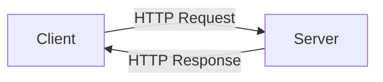
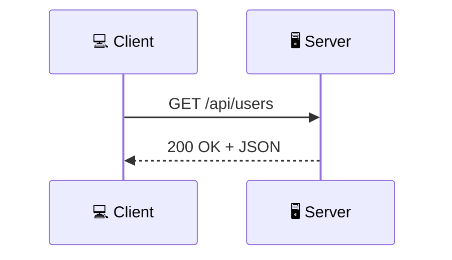
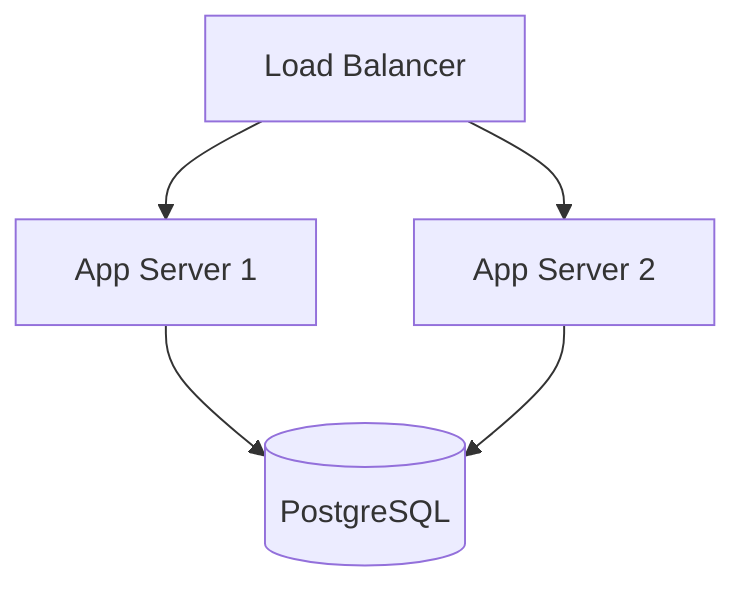

# Phœbus — Instructor Guide

> This guide details how to create and maintain learning paths on the Phœbus platform. All content is written in **Markdown**, version-controlled in **Git repositories**, and synchronized automatically.

---

## Table of Contents

1. [Core Principles](#1-core-principles)
2. [Content Repository Structure](#2-content-repository-structure)
3. [The `phoebus.yaml` File](#3-the-phoebusyaml-file)
4. [Modules (`index.md`)](#4-modules-indexmd)
5. [Steps](#5-steps)
   - [Lesson](#51-lesson)
   - [Quiz](#52-quiz)
   - [Terminal Exercise](#53-terminal-exercise)
   - [Code Exercise](#54-code-exercise)
6. [Supported Markdown](#6-supported-markdown)
   - [Mermaid Diagrams](#mermaid-diagrams)
   - [Admonitions (Callouts)](#admonitions-callouts)
7. [Assets (Images, Videos, Files)](#7-assets-images-videos-files)
8. [Synchronization and Updates](#8-synchronization-and-updates)
9. [Best Practices](#9-best-practices)
10. [Quick Reference](#10-quick-reference)

---

## 1. Core Principles

Phœbus follows a **content-as-code** approach: learning paths are simple Markdown files organized in a Git repository. This provides:

- **Version control** — every change is tracked via Git
- **Collaboration** — instructors work with pull requests and code reviews
- **Agility** — updating content = editing a file + push
- **Reproducibility** — content is always in a known state

One Git repository = one learning path. Each subdirectory is a module, and each `.md` file is a step.

---

## 2. Content Repository Structure

Phœbus treats any Git repository as a potential source of learning content. A repository can be a **dedicated training repo** or a **standard project repo** (with code, CI, docs) that also contains learning paths. Phœbus simply looks for directories with a `phoebus.yaml` file.

### Single-Path Layout

When `phoebus.yaml` is at the root, the entire repo is one Learning Path:

```
my-learning-path/
├── phoebus.yaml                          # ① Learning path metadata
│
├── 01-first-module/                      # ② Module (numeric prefix = order)
│   ├── index.md                          #    Module metadata
│   ├── 01-introduction.md                #    Step: lesson
│   ├── 02-essential-commands.md          #    Step: lesson
│   ├── 03-navigation-exercise.md         #    Step: terminal exercise
│   ├── 04-quiz.md                        #    Step: quiz
│   └── 05-fix-config/                    #    Step: code exercise (directory)
│       ├── instructions.md               #        Instructions + patches
│       └── codebase/                     #        Code files to review
│           ├── config.yaml
│           └── main.go
│
├── 02-second-module/
│   ├── index.md
│   ├── 01-theory.md
│   └── 02-quiz.md
│
└── 03-third-module/
    ├── index.md
    └── ...
```

### Multi-Path Layout

When there is **no** `phoebus.yaml` at the root, Phœbus scans immediate subdirectories. Each subdirectory containing a `phoebus.yaml` becomes a separate Learning Path. Other files and directories are ignored.

```
my-training-repo/                  # Any Git repo
├── README.md                      # Ignored by Phœbus
├── .github/                       # CI/CD, ignored
├── src/                           # Application code, ignored
├── networking/                    # ← Learning Path 1
│   ├── phoebus.yaml
│   ├── 01-fundamentals/
│   │   ├── index.md
│   │   └── 01-basics.md
│   └── ...
├── ssh/                           # ← Learning Path 2
│   ├── phoebus.yaml
│   └── ...
└── kubernetes/                    # ← Learning Path 3
    ├── phoebus.yaml
    └── ...
```

> **Note:** The two layouts are mutually exclusive. If `phoebus.yaml` exists at the root, subdirectories are not scanned.

### Ordering Rules

The order of modules and steps is determined by the **numeric prefix** of the file or directory name:

- `01-introduction.md` will be displayed before `02-commands.md`
- `01-basics/` will be displayed before `02-advanced/`
- Files without a numeric prefix are sorted alphabetically after numbered files
- The numeric prefix is **stripped** from the name displayed in the platform

> 💡 **Recommended convention**: use two-digit prefixes (`01-`, `02-`, ..., `99-`) for clear ordering.

---

## 3. The `phoebus.yaml` File

The `phoebus.yaml` file at the repository root describes the learning path metadata. It is the entry point Phœbus uses to identify and index the path.

### Available Fields

| Field | Type | Required | Description |
|-------|------|:--------:|-------------|
| `title` | string | ✅ | Learning path title |
| `description` | string | | Description displayed on the path card |
| `icon` | string | | Icon (emoji or identifier) |
| `tags` | string[] | | Tags for filtering and search |
| `estimated_duration` | string | | Estimated duration (e.g., `"12h"`, `"2h30m"`) |
| `prerequisites` | string[] | | Titles of prerequisite learning paths |

### Full Example

From the [Linux Fundamentals](https://github.com/fsamin/phoebus-content-samples) path:

```yaml
title: "Linux Fundamentals"
description: "Master the Linux command line, SSH remote access, and GPG encryption. The essential foundation for any DevOps engineer."
icon: "linux"
tags: ["linux", "ssh", "gpg", "security", "cli"]
estimated_duration: "12h"
prerequisites: []
```

Another example, with prerequisites:

```yaml
title: "Containerization with Docker & Helm"
description: "Build, ship, and run applications with Docker. Package Kubernetes applications with Helm charts."
icon: "docker"
tags: ["docker", "containers", "helm", "packaging", "devops"]
estimated_duration: "14h"
prerequisites:
  - "linux-fundamentals"
  - "git-mastery"
```

---

## 4. Modules (`index.md`)

Each module directory **must** contain an `index.md` file that describes the module. Metadata is written in **YAML front matter** (delimited by `---`).

### Available Fields

| Field | Type | Required | Description |
|-------|------|:--------:|-------------|
| `title` | string | ✅ | Module title |
| `description` | string | | Module description |
| `competencies` | string[] | | Competencies covered by the module |

### Example

```markdown
---
title: "Linux Basics"
description: "Navigate the filesystem, master essential commands, and understand file permissions."
competencies:
  - "linux-filesystem"
  - "linux-commands"
  - "linux-permissions"
---

# Linux Basics

This module covers the essential Linux skills every DevOps engineer needs:
navigating the filesystem, manipulating files, and understanding permissions.
By the end of this module, you will be comfortable working in a Linux terminal.
```

The Markdown content after the front matter is displayed as the module introduction.

---

## 5. Steps

Each step is a `.md` file inside a module directory. The front matter defines the step type.

### Common Front Matter for All Steps

| Field | Type | Required | Description |
|-------|------|:--------:|-------------|
| `title` | string | ✅ | Step title |
| `type` | string | ✅ | Type: `lesson`, `quiz`, `terminal-exercise`, `code-exercise` |
| `estimated_duration` | string | | Estimated duration (e.g., `"15m"`, `"1h"`) |

---

### 5.1 Lesson

A lesson is the simplest type: pure Markdown content, displayed as-is to the learner.

#### Example: `01-filesystem.md`

````markdown
---
title: "The Linux Filesystem"
type: lesson
estimated_duration: "20m"
---

# The Linux Filesystem

## Everything is a File

In Linux, everything is represented as a file — regular files, directories,
devices, and even processes.

## The Filesystem Hierarchy

| Path | Purpose |
|------|---------|
| `/` | Root of the filesystem |
| `/home` | User home directories |
| `/etc` | System configuration files |
| `/var` | Variable data (logs, databases) |
| `/tmp` | Temporary files |

## Navigation Commands

```bash
pwd          # Print working directory
ls -la       # List all files with details
cd /etc      # Change directory
```
````

#### What Is Supported in Lessons

- All standard Markdown (headings, lists, tables, emphasis, links, images)
- Code blocks with syntax highlighting (specify the language: ` ```bash`, ` ```yaml`, etc.)
- Image links (`http://` and `https://` URLs only)

> ⚠️ **Security**: `file://` and `javascript:` URLs are blocked. Only `http`, `https`, and `mailto` protocols are allowed in links.

---

### 5.2 Quiz

Quizzes assess learner understanding with multiple-choice or short-answer questions.

#### Syntax

The Markdown body uses a special syntax:

```
## [question-type] Question text

(choices or pattern)

> Explanation displayed after submission.
```

#### Question Types

| Type | Heading Syntax | Description |
|------|---------------|-------------|
| Multiple choice | `## [multiple-choice]` | Learner selects one or more answers |
| Short answer | `## [short-answer]` | Learner types a free-form answer |

#### Multiple-Choice Question

Answers are bullet lists with checkboxes:

- `- [x]` = **correct** answer
- `- [ ]` = **incorrect** answer

```markdown
## [multiple-choice] What does the `/etc` directory contain?

- [ ] User home directories
- [x] System configuration files
- [ ] Temporary files
- [ ] Device files

> **Explanation:** `/etc` contains system-wide configuration files.
> Examples include `/etc/ssh/sshd_config` and `/etc/hosts`.
```

> 💡 You can mark **multiple** `[x]` checkboxes to create a multi-select question (the learner must check all correct answers).

#### Short-Answer Question

The expected answer is a **regex pattern** written in an indented code block (4 spaces):

```markdown
## [short-answer] Which command follows a log file in real-time?

    tail -f

> **Explanation:** `tail -f` keeps the file open and displays new content
> as it's appended.
```

The pattern is evaluated as a **regular expression** (case-insensitive). You can use:

- `tail -f` — exact match
- `tail\s+(-f|--follow)` — accepts `-f` or `--follow`
- `mkdir\s+-p\s+.*` — accepts any path after `mkdir -p`

> ⚠️ **The regex pattern is validated at sync time.** An invalid regex will cause the sync to fail.

#### Full Quiz Example

From the [Linux Fundamentals](https://github.com/fsamin/phoebus-content-samples) path:

```markdown
---
title: "Linux Basics Quiz"
type: quiz
estimated_duration: "10m"
---

# Linux Basics Quiz

## [multiple-choice] What does the `/etc` directory contain?

- [ ] User home directories
- [x] System configuration files
- [ ] Temporary files
- [ ] Device files

> **Explanation:** `/etc` (et cetera) contains system-wide configuration files.

## [multiple-choice] What permission octal value represents `rwxr-xr-x`?

- [ ] 777
- [x] 755
- [ ] 644
- [ ] 700

> **Explanation:** `rwx` = 7, `r-x` = 5, `r-x` = 5. So the octal value is 755.

## [short-answer] Which command follows a log file in real-time?

    tail -f

> **Explanation:** `tail -f` (follow) keeps the file open and displays
> new content as it's appended.

## [short-answer] What command creates a nested directory structure in one command?

    mkdir -p /opt/myapp/config/templates

> **Explanation:** The `-p` flag creates all intermediate directories as needed.
```

---

### 5.3 Terminal Exercise

A terminal exercise simulates a command-line environment. The learner must select the correct command at each step in a styled interactive terminal.

#### Syntax

````
(introduction text before the first step)

## Step N: Step title

Context and instructions.

```console
$ ▌
```

- [x] `correct-command` — Explanation of why this is correct.
- [ ] `incorrect-command` — Explanation of why this is incorrect.
- [ ] `other-incorrect-command` — Another explanation.

```output
simulated output after the correct command
```
````

#### Rules

| Element | Rule |
|---------|------|
| Introduction | Free text before the first `## Step` |
| Steps | Numbered with `## Step N` |
| Prompt | ` ```console ` block with `$ ▌` |
| Proposals | `- [x]` (correct) or `- [ ]` (incorrect), command in backticks |
| Explanation | After ` — ` (em dash) in each proposal |
| Output | ` ```output ` block displayed after the correct answer |
| Exactly 1 `[x]` | ✅ **One and only one** correct answer per step |

#### Full Example

From the [Linux Fundamentals — Navigate the Filesystem](https://github.com/fsamin/phoebus-content-samples) path:

````markdown
---
title: "Navigate the Filesystem"
type: terminal-exercise
estimated_duration: "10m"
---

# Navigate the Filesystem

You've just connected to a freshly provisioned Linux server.
Your first task is to explore the system.

## Step 1: Find your current location

Where are you in the filesystem? Print your current working directory.

```console
$ ▌
```

- [x] `pwd` — Prints the absolute path of the current working directory.
- [ ] `ls` — Lists directory contents but doesn't show your location.
- [ ] `whoami` — Shows your username, not your location.

```output
/home/devops
```

## Step 2: List all files including hidden ones

Your home directory might contain hidden configuration files (dotfiles).

```console
$ ▌
```

- [ ] `ls` — Only shows non-hidden files.
- [x] `ls -la` — Shows all files including hidden ones, with details.
- [ ] `ls -l` — Shows details but skips hidden files.

```output
total 24
drwxr-xr-x 3 devops devops 4096 Jan 15 10:30 .
drwxr-xr-x 4 root   root   4096 Jan 15 10:00 ..
-rw-r--r-- 1 devops devops  220 Jan 15 10:00 .bash_logout
-rw-r--r-- 1 devops devops 3771 Jan 15 10:00 .bashrc
drwx------ 2 devops devops 4096 Jan 15 10:30 .ssh
```

## Step 3: Find configuration files

Locate all `.conf` files under `/etc` that contain the word "listen".

```console
$ ▌
```

- [ ] `find /etc -name "*.conf"` — Finds conf files but doesn't search contents.
- [ ] `ls /etc/*.conf` — Only lists files in /etc, not subdirectories.
- [x] `grep -rl "listen" /etc/*.conf 2>/dev/null` — Recursively searches for "listen" in .conf files.

```output
/etc/ssh/sshd_config.conf
```
````

#### How It Renders in Phœbus

The terminal exercise is displayed as a real terminal: the learner sees the prompt, command proposals, and simulated output appears progressively after each correct answer.

---

### 5.4 Code Exercise

The code exercise is the richest type. It presents the learner with a **full codebase** in a Monaco editor (the same as VS Code), and asks them to **identify a problem** then **select the correct fix** from several patches (diffs).

#### Filesystem Structure

Unlike other types, a code exercise uses a **directory** instead of a single file:

```
03-fix-dockerfile/
├── instructions.md      # Instructions, description, patches
└── codebase/            # Code files displayed in the editor
    ├── Dockerfile
    ├── main.go
    └── go.mod
```

> ⚠️ Phœbus automatically detects that a step is a code exercise when a **directory** contains an `instructions.md` file.

#### `instructions.md` Front Matter

| Field | Type | Required | Description |
|-------|------|:--------:|-------------|
| `title` | string | ✅ | Exercise title |
| `type` | string | ✅ | Must be `code-exercise` |
| `mode` | string | ✅ | Exercise mode (see below) |
| `estimated_duration` | string | | Estimated duration |
| `target` | object | ✅* | File and lines containing the problem |
| `target.file` | string | ✅* | Relative path of the file in `codebase/` |
| `target.lines` | int[] | ✅* | Line numbers of the problematic lines |

\* Required for `identify-and-fix` mode.

#### Exercise Modes

| Mode | Phase 1 | Phase 2 | Description |
|------|---------|---------|-------------|
| `identify-and-fix` | Identify the problematic lines | Choose the correct patch | The learner must first click on the correct lines, then select the right diff |

#### `instructions.md` Syntax

````
(free-form problem description in Markdown)

## Patches

### [x] Correct patch title

Explanation of why this is the right solution.

```diff
--- a/Dockerfile
+++ b/Dockerfile
@@ -1,8 +1,14 @@
-FROM golang:1.22
+FROM golang:1.22-alpine AS builder
 ...
```

### [ ] Incorrect patch title

Explanation of why this approach doesn't work.

```diff
--- a/Dockerfile
+++ b/Dockerfile
@@ -7,3 +7,3 @@
-USER root
+USER nobody
```
````

#### Rules

| Element | Rule |
|---------|------|
| Patches section | Starts with `## Patches` |
| Patches | Delimited by `### [x]` (correct) or `### [ ]` (incorrect) |
| Diff | ` ```diff ` block in **unified diff** format |
| Exactly 1 `[x]` | ✅ **One and only one** correct patch |
| Codebase | All text files in `codebase/` (binary files are ignored) |

#### Full Example

From the [Containerization — Fix the Dockerfile](https://github.com/fsamin/phoebus-content-samples) path:

**`03-fix-dockerfile/instructions.md`**:

````markdown
---
title: "Fix the Dockerfile"
type: code-exercise
mode: identify-and-fix
estimated_duration: "10m"
target:
  file: "Dockerfile"
  lines: [3, 8]
---

# Fix the Dockerfile

A teammate wrote a Dockerfile for a Go application, but it has several issues
that make the image insecure and bloated. The image is 1.2 GB instead of the
expected ~15 MB.

Review the Dockerfile and identify the problems.

## Patches

### [x] Use multi-stage build and run as non-root

The Dockerfile should use a multi-stage build to separate compilation from
runtime, and the final image should not run as root.

```diff
--- a/Dockerfile
+++ b/Dockerfile
@@ -1,10 +1,16 @@
-FROM golang:1.22
-WORKDIR /app
-COPY . .
-RUN go build -o server .
-EXPOSE 8080
-ENV GIN_MODE=release
-USER root
-CMD ["./server"]
+FROM golang:1.22-alpine AS builder
+WORKDIR /src
+COPY go.mod go.sum ./
+RUN go mod download
+COPY . .
+RUN CGO_ENABLED=0 go build -o /server .
+
+FROM alpine:3.19
+RUN addgroup -S app && adduser -S app -G app
+COPY --from=builder /server /server
+EXPOSE 8080
+ENV GIN_MODE=release
+USER app
+CMD ["/server"]
```

### [ ] Just change the USER directive

Changing `USER root` to `USER nobody` fixes the security issue but the image
is still bloated because the entire Go toolchain is included.

```diff
--- a/Dockerfile
+++ b/Dockerfile
@@ -7,3 +7,3 @@
 ENV GIN_MODE=release
-USER root
+USER nobody
 CMD ["./server"]
```

### [ ] Add .dockerignore only

A `.dockerignore` file helps but doesn't solve the fundamental problem of
including the Go toolchain in the final image.

```diff
--- a/Dockerfile
+++ b/Dockerfile
@@ -1,4 +1,4 @@
-FROM golang:1.22
+FROM golang:1.22-alpine
 WORKDIR /app
 COPY . .
 RUN go build -o server .
```
````

**`03-fix-dockerfile/codebase/Dockerfile`**:

```dockerfile
FROM golang:1.22
WORKDIR /app
COPY . .
RUN go build -o server .
EXPOSE 8080
ENV GIN_MODE=release
USER root
CMD ["./server"]
```

#### How It Renders in Phœbus

1. **"Identify" phase** — The Monaco editor displays the codebase. The learner clicks on lines they think are problematic (the lines defined in `target.lines`).
2. **"Fix" phase** — The proposed patches are displayed as diffs. The learner selects the one they think is correct. The diff is shown in a comparison editor (diff viewer).

---

## 6. Supported Markdown

Phœbus uses a full Markdown rendering engine. Here is what is supported in lessons:

### Basic Syntax

| Element | Syntax |
|---------|--------|
| Headings | `# H1`, `## H2`, `### H3`, etc. |
| Bold | `**bold text**` |
| Italic | `*italic text*` |
| Inline code | `` `code` `` |
| Link | `[text](https://url.com)` |
| Image | `` |
| Unordered list | `- item` or `* item` |
| Ordered list | `1. item` |
| Blockquote | `> quote` |
| Horizontal rule | `---` |

### Code Blocks

Use triple backticks with the language for syntax highlighting:

````markdown
```go
func main() {
    fmt.Println("Hello, World!")
}
```
````

Supported languages: `bash`, `sh`, `go`, `python`, `javascript`, `typescript`, `yaml`, `json`, `dockerfile`, `hcl`, `sql`, `html`, `css`, and more.

### Tables

```markdown
| Column 1 | Column 2 | Column 3 |
|----------|----------|----------|
| value    | value    | value    |
```

### Mermaid Diagrams

Phœbus renders **Mermaid** diagrams directly in lessons. Use a fenced code block with the `mermaid` language tag:

````markdown

````

Supported diagram types:

| Type | Directive | Use Case |
|------|-----------|----------|
| **Flowchart** | `graph TD` or `graph LR` | Architecture, workflows, decision trees |
| **Sequence diagram** | `sequenceDiagram` | Protocol flows, API interactions |
| **Class diagram** | `classDiagram` | Data models, object relationships |
| **State diagram** | `stateDiagram-v2` | Lifecycle, state machines |
| **Gantt chart** | `gantt` | Timelines, project planning |
| **Pie chart** | `pie` | Proportions, statistics |

#### Examples

**Sequence diagram** (great for protocol explanations):

````markdown

````

**Architecture diagram**:

````markdown

````

> 💡 **Tip:** Preview your Mermaid diagrams at [mermaid.live](https://mermaid.live) before committing. Syntax errors will cause the diagram to display as raw text.

### Admonitions (Callouts)

Phœbus supports styled callout blocks using the [directive syntax](https://github.com/remarkjs/remark-directive):

````markdown
:::tip
Use `ssh-keygen -t ed25519` for the most secure and compact key type.
:::

:::warning
Never share your private key with anyone!
:::

:::danger
Running `rm -rf /` will destroy your entire filesystem.
:::

:::info
SSH uses port 22 by default.
:::

:::note
This feature requires OpenSSH 8.0 or later.
:::

:::caution
Changing `sshd_config` without keeping an active session open can lock you out.
:::
````

Available types:

| Type | Icon | Color | Use Case |
|------|------|-------|----------|
| `tip` | 💡 | Green | Best practices, pro tips |
| `info` | ℹ️ | Blue | Additional context, FYI |
| `note` | 📝 | Gray | Side notes, clarifications |
| `warning` | ⚠️ | Orange | Important caveats |
| `caution` | ⚠️ | Orange | Same as warning |
| `danger` | 🚨 | Red | Critical mistakes, security risks |

### Allowed Protocols

For security reasons, only these protocols are accepted in links and images:

| Attribute | Allowed Protocols |
|-----------|-------------------|
| `href` (links) | `http`, `https`, `mailto` |
| `src` (images) | `http`, `https` |

`file://`, `javascript:`, and `data:` URLs are **blocked**.

---

## 7. Assets (Images, Videos, Files)

Phœbus supports **binary assets** (images, videos, PDFs, etc.) in your lessons. Assets are automatically uploaded and served by the platform.

### Directory Structure

Place your assets in an `assets/` directory **next to your step files** (inside the module directory):

```
01-linux-basics/
├── index.md
├── 01-intro.md
├── 02-commands.md
├── assets/
│   ├── terminal-screenshot.png
│   ├── demo-video.mp4
│   └── architecture-diagram.svg
└── 03-exercise/
    ├── instructions.md
    ├── assets/
    │   └── expected-output.png
    └── codebase/
        └── main.go
```

- For **regular steps** (lesson, quiz, terminal-exercise): the `assets/` directory is at the **module level**, shared by all steps in that module.
- For **code exercises**: the `assets/` directory can be **inside the exercise directory**, specific to that exercise.

### Referencing Assets in Markdown

Use **relative paths** starting with `./assets/` or `assets/`:

```markdown
## Understanding the Linux Filesystem

Here is an overview of the directory structure:


Watch this demonstration:


Listen to the explanation:


```

### Supported Formats

| Type | Formats | Rendering |
|------|---------|-----------|
| **Images** | `.png`, `.jpg`, `.jpeg`, `.gif`, `.svg`, `.webp` | `` tag |
| **Videos** | `.mp4`, `.webm`, `.ogg`, `.mov` | `<video>` player with controls |
| **Audio** | `.mp3`, `.wav`, `.ogg`, `.flac`, `.aac` | `<audio>` player with controls |
| **Other** | `.pdf`, etc. | Download link |

> 💡 Videos and audio files referenced with `` syntax are automatically rendered as `<video>` or `<audio>` players in the lesson view.

### How It Works

During synchronization, Phœbus:

1. **Detects** all files in `assets/` directories
2. **Hashes** each file (SHA-256) for deduplication
3. **Uploads** new files to the asset store (filesystem or S3)
4. **Rewrites** relative URLs in your markdown to `/api/assets/{hash}`
5. **Caches** assets with immutable headers (since hash = content, the URL never changes)

This means:
- The **same image** used in multiple steps is stored **only once**
- Assets are served with **aggressive HTTP caching** for fast loading
- Your markdown stays clean with **relative paths** — the rewriting is transparent

### Size Limits

The maximum file size per asset is **configurable** (default: **50 MB**). Files exceeding this limit are skipped with a warning in the sync logs.

> ⚠️ **Tip:** Compress videos before adding them to your repository. Use modern codecs like H.264 (MP4) or VP9 (WebM) for best quality/size ratio.

---

## 8. Synchronization and Updates

### Adding a Content Repository

1. Log in as an **administrator** on Phœbus
2. Go to **Admin → Repositories**
3. Add your Git repository URL (HTTPS or SSH)
4. Trigger the synchronization

### Smart Synchronization (Hash-Based)

Phœbus uses a **SHA-256 hash** system to optimize synchronization:

- Each step is hashed (title + type + duration + content + exercise data)
- Each module is hashed (metadata + step hashes)
- Each learning path is hashed (metadata + module hashes)

**Practical consequences:**

| Situation | Behavior |
|-----------|----------|
| Unchanged content | ⏭ Skipped (no DB writes) |
| Modified content | ✏️ Updated, learner progress **preserved** |
| New content | ✅ Added |
| Removed content | 🗑 Soft-deleted (learner progress is preserved) |
| Reappearing content | ♻️ Automatically restored |

> 💡 **Learner progress is never lost** during a re-sync, even when content changes.

### Webhook for Automatic Synchronization

You can configure a Git webhook (GitHub, GitLab, Bitbucket) to trigger synchronization automatically on every push. The webhook URL is available in the admin interface.

---

## 9. Best Practices

### Content Organization

- **Group related paths** in the same repository when they share a theme (e.g., all networking courses together). Use separate repos for unrelated domains
- **3 to 7 steps per module** — Enough to cover a topic, not too many to discourage learners
- **Alternate step types** — Lesson → Exercise → Quiz to maintain engagement
- **End each module with a quiz** — To validate knowledge retention

### Writing Lessons

- Get to the point, avoid overly long paragraphs
- Use **tables** for quick reference
- Include **code blocks** with the language for syntax highlighting
- Use **lists** rather than paragraphs for instruction sequences

### Writing Quizzes

- **3 to 6 questions per quiz** is a good balance
- Mix `multiple-choice` and `short-answer` types
- Write **explanations** for every question (`>`) — this is the teaching moment
- For `short-answer`, use flexible regex patterns: `mkdir\s+-p` rather than `mkdir -p /exact/path`

### Writing Terminal Exercises

- **3 to 5 steps** per exercise
- Each step should be **self-contained** with enough context
- Provide **3 commands** per step (1 correct + 2 incorrect)
- Incorrect commands should be **plausible** (common beginner mistakes)
- Always include an `output` block — it helps the learner visualize the result

### Writing Code Exercises

- The `codebase/` should be **minimal and realistic** (no unnecessary files)
- The `target.file` must match a file in `codebase/` exactly
- The `target.lines` should point to actually problematic lines
- Provide **3 patches** (1 correct + 2 incorrect) with different approaches
- Incorrect patches should represent **common mistakes** (partial fix, wrong approach)
- Diffs must be in valid **unified diff** format

### Recommended Git Workflow

```
main
 └── feature/update-module-2
      ├── Edit content
      ├── Commit + Push
      ├── Pull Request + Peer review
      └── Merge → Automatic sync via webhook
```

---

## 10. Quick Reference

### Step Types

| Type | File | Interactive | Description |
|------|------|:-----------:|-------------|
| `lesson` | `*.md` | ❌ | Rendered Markdown content |
| `quiz` | `*.md` | ✅ | Multiple-choice and short-answer questions |
| `terminal-exercise` | `*.md` | ✅ | Terminal simulation with command selection |
| `code-exercise` | `directory/instructions.md` + `codebase/` | ✅ | Code review + patch selection |

### Quiz Question Syntax

```
## [multiple-choice] Question text
- [x] Correct answer
- [ ] Wrong answer
> Explanation

## [short-answer] Question text
    regex-pattern
> Explanation
```

### Terminal Exercise Syntax

````
## Step N: Title
Context.
```console
$ ▌
```
- [x] `correct-command` — Explanation
- [ ] `wrong-command` — Explanation
```output
result
```
````

### Code Exercise Syntax

```yaml
# instructions.md front matter
type: code-exercise
mode: identify-and-fix
target:
  file: "path/to/file.go"
  lines: [3, 8]
```

````
## Patches
### [x] Correct patch
Explanation.
```diff
unified diff
```
### [ ] Wrong patch
Explanation.
```diff
unified diff
```
````

### Decision Tree: Which Step Type to Choose?

```
Does the learner need to do something?
├── No → lesson
└── Yes
    ├── Answer knowledge questions? → quiz
    ├── Execute commands in a terminal? → terminal-exercise
    └── Analyze and fix source code? → code-exercise
```

---

## Resources

- **Sample repository**: [fsamin/phoebus-content-samples](https://github.com/fsamin/phoebus-content-samples) — a multi-path repo containing 8 learning paths:
  - `linux-fundamentals/` — Lessons, quizzes, terminal exercises
  - `containerization/` — Code exercise (Fix the Dockerfile)
  - `golang-programming/` — Full path with all exercise types
  - `kubernetes/` — Advanced terminal exercises
  - `git-mastery/` — Git exercises
  - `virtualization/` — From theory to vSphere & OpenStack, with quizzes
  - `networking/` — TCP/IP, DNS, HTTP, SSL/TLS with Mermaid diagrams
  - `ssh/` — From zero to The Bastion (OVH), key management, server hardening
